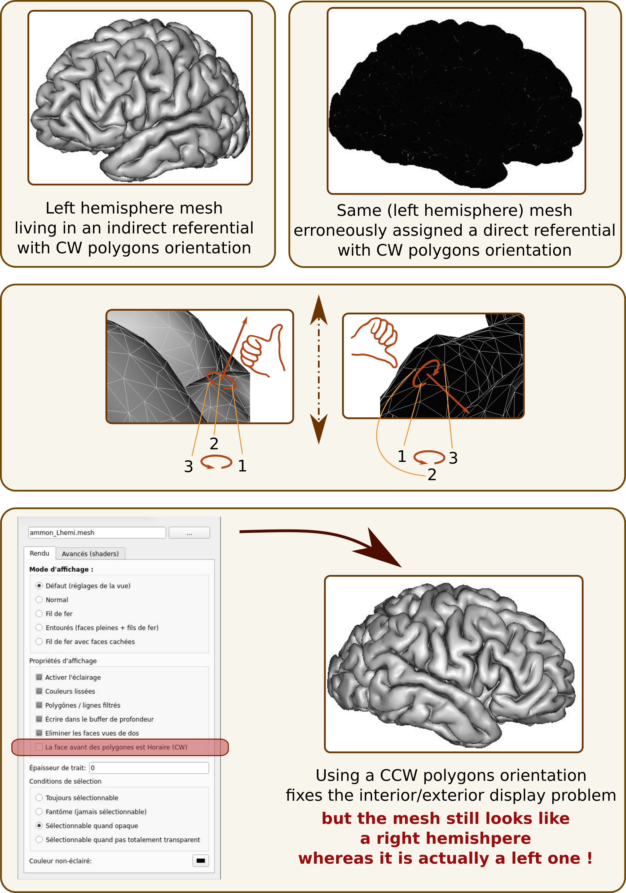
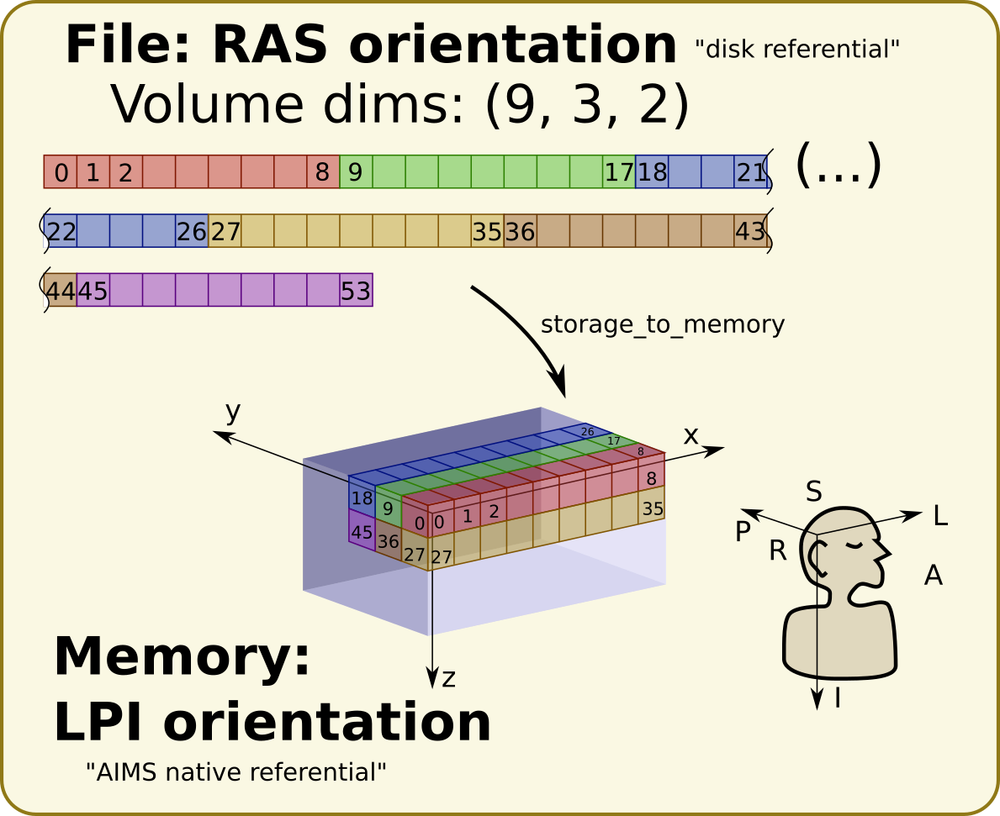

===================
Coordinates systems
===================

A few definitions
=================

**Voxel**: a 3D pixel in a bitmap image: in other words, a small cube, generally associated with a value. The value may have any type (float, int, RGB color, vector...). Generalizing the 3D concept, we may manupulate data in 4D, or more dimensions: the voxel there has more than 3 dimensions. A voxel has a size (dimension in mm), in each dimension. Voxels are assumed to be aligned in a grid in regular data we manipulate in neuroimaging.

**Voxel size**: floating point dimension of the voxel, in each dimension, in millimeters. May be 3D, 4D, or more. Only meaningful for "voxelized data", bitmap images or "buckets". A mesh has float coordinates, and thus does not have voxels nor a voxel size.

**Coordinates**: 3D position: 3 floating point numbers.

- Float coordinates: generally in millimeters.
- Voxel coordinates: In images or "buckets", it may be given as int coordinates, that is voxel indices in a voxels grid (array, image, bucket). To get the "real world" float mm coordinates, voxel int coords normally just need to be multiplied with the voxel sizes. This assumes the real world origin is in the center of the "first" voxel in the array. The array orientation however, may differ between different conventions and arrangements, thus additional coordinates transformations may be required. (see later)

To be usable, coordinates must be associated with a coordinates system (a referential) which specifies where the origin is, and where the axes go.

**Referential**: a coordinates system. Generally only defined by an identifier (a name, or an UUID). A referential is relative to other referentials, thus is mainly defined by transformations to/from other referentials. However it may specify additional information, like where is the origin, where the axes go, how they are oriented, if it is "direct" or "indirect".

- Direct referential: follows the `"right hand rule" <https://en.wikipedia.org/wiki/Right-hand_rule>`_
- Indirect referential: opposite: one axis is contradicting the "right hand rule".

For brain images, we often characterize axes orientations relatively to the head: AP (anterior to posterior) or PA, LR (left to right) or RL, SI (superior to inferior) or IS. To summarize the 3 axes we sometimes use the 3 initials of the directions axes are pointing to: RAS (X: to Right, Y: to Anterior, Z: to Superior), LAS, LPI, etc.

http://www.grahamwideman.com/gw/brain/orientation/orientterms.htm

**Transformation**: a mathematical operation allowing to transform coordinates from one referential to another referential. We normally use them in real world float mm coordinates, but going from voxels to mm may be represented as a transformation per se.

Coordinates systems
===================

Mesh coordinates
----------------

Mesh coordinates are "simpler" because they are always real world mm coordinates. However their referential has to be specified.

When a mesh is built from meshing an object in a voxels volume (like a brain segmentation) using the AIMS Mesher (like the ``AimsMesh``, ``AimsMeshBrain``, ``AimsMeshWhite`` commands), then the mesh referential is the AIMS referential of the volume data, in mm (see below).

Meshes obtained by other software, like Freesurfer, may reside in different referentials.

Direct and indirect referentials for meshes
+++++++++++++++++++++++++++++++++++++++++++

A mesh is composed of, at least, vertices (points with 3D positions) and polygons (list of vertices forming a face - generally triangles, that is 3 vertices per polygon). The orientation of vertices in a polygon indicates which side of the polygon is the "exterior" of the mesh. Rendering software may display differently internal and external sides of meshes, or not render at all the internal side for optimization purposes. This is the default in several software, including Anatomist.

The external side of a polygon is determined by a "counter-clockwise" or "clockwise" parameter, and the right hand rule (`see here, the section "Curve orientation and normal vectors" <https://en.wikipedia.org/wiki/Right-hand_rule>`_).

Meshes may provide normal vectors, which are supposed to point to the outside direction.

If a mesh resides in a *direct referential*, but is interpreted as being coordinates in an *indirect referential* (or the contrary), then  the inside and outside notions will be reversed, and meshes will not be rendered correctly:

- polygons will likely appear black or invisible
- the mesh will appear as symmetrical to what it is: typically a left hemisphere mesh will look like a right one, and the contrary, **which can lead to dramatic mistakes**.

Volume coordinates
------------------

The volume case is much more complex: volumes use voxels. Voxels are data arrays, and the order voxels are stored can matter. Different software may interpret their order differently. Different file formats may store them differently.

For instance, NIFTI files allow to store voxels data in any order (x rows as contiguous data on disk, then y columns, then z slices, with RAS orientation or any other). Their orientation is actually known only in the transformations between this "disk voxels order" to known referentials (like MNI ICBM, or a "scanner" referential with known axes orientation). If no transformation is specified in the file, then voxels order is unknown, which is wrong.

The "Scanner-based coordinates" referential in NIFTI files is always assumed to be in **RAS orientation**, like the MNI ICBM one.

Some software use natively the "disk voxels orientation", like SPM or Nibabel. Some other use a constant orientation in computer memory, like AIMS and Anatomist. Thus there is a transformation between the disk orientation and the memory orientation (this transformation, contrarily to most others, is working in voxel int coordinates).

AIMS is always loading data in memory in a constant orientation, namely a **"LPI" orientation**.

**Note that this referential is indirect**.

An example:

Then there may exist transformations between the memory referential and other referentials.

Note that a volume is an array of voxels with given dimensions: int voxels coordinates must fit into a bounding box, with positive indices, and must not exceed the dimension of the volume array, otherwise data will end up outside of the volume storage, which will result in lost data (at best), or programs crashes...

.. _aims_conventions:

AIMS conventions
----------------

AIMS always loads voxel data in a **"LPI" orientation**, as said above. This has pros and cons, but is consistent, format-independent, and allows to use simple operations like "imageA + imageB".

Information in AIMS headers are normalized the following way in the following header properties:

- ``referential``: the identifier of the AIMS (LPI) referential of the data in its native space.
- ``storage_to_memory``: transformation matrix (rotation/flip only) from the disk storage voxels orientation space to the AIMS referntial of the data. Applied to int voxels coordinates, the matrix only contains -1, 0 and 1 values, plus a translation to compensate filpped axes.
- ``referentials``: (note the ``s`` at the end) list of referential IDs (or names) toward which transformations are provided.
- ``transformations``: list of affine transformation matrices. There should be the same number of transformations as there are items in the ``referentials`` list. Each transformation goes from the AIMS referential of the data to the referential item at the same position in the ``referentials`` list.

The AIMS referential is a convention for AIMS and only software based on AIMS, like Anatomist. Other software do not necessarily follow the same convention (and actually, no other software does). So transforms here cannot be simply passed to other software: they have to be converted (combined with other transformations) to go from/to other software conventions.

Data formats, as said above, use their own conventions and orientations to store voxels on disk. The transforms provided with AIMS headers always try to correctly convert transformations to get to/from the AIMS referential of the data.

To convert from/to software which are working in the disk storage orientation, the ``storage_to_memory`` matrix may be used.

Note that the AIMS internal convention is **LPI** orientation is an indirect referential, and is the "contrary" to the standard MNI ICBM referential, which is a direct referential. All 3 axes directions are flipped. But the axes orientations are the same (1st axis, "x" is left/right, "y" is anterior/posterior, "z" is superior/inferior). Thus transformation matrices contain negative numbers on their diagonal.

.. _specify_transforms:

Specifying transformations in AIMS
==================================

A transformation may be found at different places:

- as part of a data file header: NIFTI (volumes) and GIFTI (meshes) formats can provide transformations from the data space to other coordinates systems. AIMS provides them following its conventions (see :ref:`AIMS conventions <aims_conventions>` above) in data objects header properties.

- an affine transormation file. AIMS uses the ``.trm`` format, which is a very simple text file specifying the matrix as 12 coefficients:

    +-----+-----+-----+
    |  Tx |  Ty |  Tz |
    +-----+-----+-----+
    | R11 | R12 | R13 |
    +-----+-----+-----+
    | R21 | R22 | R23 |
    +-----+-----+-----+
    | R31 | R32 | R33 |
    +-----+-----+-----+

  Tx, Ty, Tz are the translation coefficients, and R11.. R33 are the linear matrix cooefficients.

- a vector field for non-linear transformations (free form or "FFD" deformations) which are generally stored in 3D volumes containing a displacement vector (3 coordinates) in each voxel, or a 5D NIFTI volume file where the 5th dimension has size 3 and provides the displacement vectors coordinates.

- a combnination of such transformations, given "by hand"

- in a transformation graph (which may be a YAML or JSON file). See the :ref:`dedicated section for transformation graph <transform_graph>`.

AIMS commands (like ``AimsApplyTransform``) which take transformations as inputs, and the ``Reader`` API in C++ and Python languages can accept all these forms, with the following syntax. Note that some commands and functions allow only affine transformations. The syntax is illustrated as using the PyAims python API, but the same "filenames" can be given to the commands options.

See also: :doc:`AIMS IO system <aims_io>`.

- transformation filename with extension, either ``filename.trm`` for an affine transform, or ``filename.ima`` or ``filename.nii.gz`` for a vector field::

    from soma import aims, aimsalgo
    # aimsalgo is needed because FFD vector fields are defined there, and not
    # in aims(data)

    transform = aims.read('filename.trm')
    # or, to take the inverse:
    transform_inv = aims.read('filename.trm?inv=1')
    # for vector field we must provide dtype to avoid confusion with reading a
    # volume object, since it's the same file
    ffd_trans = aims.read('filename.ima', dtype='Transformation3d')

- transformation in a data file header, using the "fake extension" ``.trmhdr``::

    # take the 1st transform in the header
    transform = aims.read('filename.nii.trmhdr')
    # or, to be more precise, or take the 2nd transform:
    transform2 = aims.read('filename.nii.trmhdr?index=1')
    # or, to take the inverse of the 2nd transform:
    transform2_inv = aims.read('filename.nii.trmhdr?index=1&inv=1')

- composition of transformations: they will be composed using the composition operator (`̀`*``), using the "fake extension" ``.trmc``::

    transform = aims.read('file1.trm?inv=1*file2.nii.trmhdr?index=1.trmc?')

  Note that, here, the tailing ``?`` is needed to avoid a parsing error: if we don’t supply it, the IO system will parse the filename as ``file1.trm?inv=1*file2.nii.trmhdr`` with options ``{"index": "1.trmc"}``, which is not what we want here.

- transformation between two identified referentials in a transormations graph (see :ref:`Transformation graph <transform_graph>` below)::

    transform = aims.read('graph.yaml?source=MNI Colin 27&dest=MNI 152 ICBM 2009c Nonlinear Asymmetric')

.. _transform_graph:

Transformation graph
====================

Graph
-----

Transformations graphs have been introduced in Aims 5.1 (in 2022). A transformation graph is a structure which stores referentials and transformations between them, and allow to simplify access to them. They perform automatic composition, and inversion when possible, and can provide a transformations path between two given referentials, either as a composed transformation, or a composition chain.

The graph describes the transformations graph structure, and performs lazy loading of transformation files, and composition when needed along a path. Composed (deduced) paths are stored in the graph in order to speed up later access.

Individual transformations may be in any of the formats specified in the above section :ref:`Specifying transformations in AIMS <specify_transforms>`.

The graph structure is a dictionary-like object, which can be read from a JSON or a YAML file, or even a MINF file - actually any file format which can be read as a generic Aims Object (or a python dictionary). The dictionary should         be organized as a 2-level dictionary::

    {
        source_ref_id: {
            dest_ref_id1: transformation_filename1,
            dest_ref_id2: transformation_filename2,
        },
        ...
    }

See the :aimsdox:`C++ API <classaims_1_1TransformationGraph3d.html>`, or the :pyaimsdev:`Python API <pyaims_api_aims.html#soma.aims.TransformationGraph3d>`.

It can be loaded using the usual API::

    graph = aims.read('graph.yaml')

Transformation
--------------

To obtain a transformation in a graph, use the ``getTransformation`` method, preferably after having loaded affine and inverse transforms in case the graph is incomplete::

    graph.registerInverseTransformations(True)
    tr = graph.getTransformation(
        'MNI Colin 27',
        'MNI 152 ICBM 2009c Nonlinear Asymmetric')

A transformation can be directly loaded from a graph file::

    tr = aims.read('graph.yaml?source=MNI Colin 27&dest=MNI 152 ICBM 2009c Nonlinear Asymmetric')

which is equivalent to the above operations.

Thus if you frequently work with the same referentials and data with the same transformations chains, it's convenient to write a graph file and reuse it later.

Combining transformations
=========================

Transformations can be combined, or *composed* to get coordinates from a "source" coordinates system to a "target" one, passing through intermediate referentials.
To correctly transform coordinates, transformations should be combined "in reverse order": transformations which should be applied first are on the "right" of the expression, and those which apply later are on the "left".

Affine transformations can be represented in matrix math shapes, as 4x4 matrices. Coordinates to be transformed are represented as colum vectors. The last line of an affine transformation matrix is normally (0, 0, 0, 1), the last column corresponds to the translation (origin shift) to be applied (the 4th coefficient of this column is 1, as it already appears on the last line). Coordinates vector are added a 4th component, which is 1.

For affine transformations, the composition operator is the mathematical matrix ``×`` operator (or ``*`` in C++ or Python languages), used in the same order. The result is also an affine transformation::

    T12 = aims.read('transform_1_TO_2.trm')
    T23 = aims.read('transform_2_TO_3.trm')
    T13 = T23 * T12

For any type of 3D transformation, combining them is possible via the operator ``*`` in AIMS / PyAIMS. In C++, this API uses reference-counters:

.. code-block:: cpp

    #include <aims/io/reader.h>
    #include <aims/transformation/transformation_chain.h>
    #include <aims/transformation/affinetransformation3d.h>

    using namespace carto;
    using namespace soma;
    using namespace aims;

    int main()
    {
      Reader<Transformation3d> r( "ffd.ima" ); // may be any type of transform
      rc_ptr<Transformation3d> t1( r.read() );

      affinetransformation3d *at2 = new affinetransformation3d;
      at2->affine()( 0, 0 ) = -1.;  // flip x axis
      at2->affine()( 0, 3 ) = 200.; // X translation
      rc_ptr<Transformation3d> t2( at2 );

      rc_ptr<Transformation3d> result = t1 * t2; // (t2 will apply first)
    }

Or, in python::

    from soma import aims, aimsalgo  # aimsalgo is needed to read non-lin trans

    t1 = aims.read('ffd.ima')
    t2 = aims.AffineTransformation3d()
    t2.affine()[0, 0, 0, 0] = -1.
    t2.affine()[0, 3, 0, 0] = 200.
    result = t1 * t2

Note that in python especially, there is no difference between handling affine or non-affine transformations for the composition operator. Just the result has a different type (``AffineTransformation3d`` if both operands are affine, or ``TransformationChain3d`` otherwise).

Resampling
==========

When resampling an image (a volume), what is actually used is the **inverse transformation**, because we need to find out, for each voxel of the destination image, where it comes from in the source image.
That's why the command ``AimsApplyTransform`` takes the inverse transform (``-I`` option) to perform volumes resampling.

Transforming a mesh, on the contrary, requires the **direct** transformation (each vertex is directly transformed).

