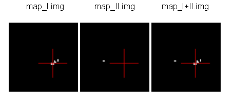

============
AIMS tuorial
============

Introduction
============

.. note:: Disclaimer

  All contributors of BrainVISA project are very happy to propose tools, libraries, demonstration data and documentation available free of charge on http://brainvisa.info. The BrainVISA project is focused on neuroimaging and the development of tools only in a context of research. Although every care has been taken by all contributors of the BrainVISA project no warranty can be given in respect of the accuracy, reliability, up-to-dateness or completeness of the information contained within BrainVISA project. In the same way no one will be responsible or liable for any loss or damage of any sort.

  Any contributor reserves the right to alter or remove the content, in full or in part, without prior notice.

In order to work through the following sections, please download the demonstration data from one of the following links:

* ftp://ftp.cea.fr/pub/dsv/anatomist/data/demo_data.zip

For more information concerning the installation, please refer to :axonman:`the handbook of BrainVISA <index.html>`.

In order to read the help of one commande line, either type

::

  command_name -h

or refer to the list of commandlines on :cmds:`http://brainvisa.info <>`.

.. highlight:: bash

Basic commandlines
==================

.. _aimsfileconvert:

``AimsFileConvert``: Performs file format and data conversion
-------------------------------------------------------------

**HELP:** :cmds:`command help <#aims_AimsFileConvert>`

**DATA:** ``data_for_anatomist/subject01/subject01.nii``.

**EXAMPLE:** here is the conversion from *NIFTI-1* to *MINC* format.

::

  prompt% AimsFileConvert -i subject01.nii -o subject01.mnc

**NOTE:** if you work with *DICOM* files, all slices of the same acquisition must be located in the same directory.

.. _aimssubvolume:

``AimsSubVolume``: Carve a subvolume in the input volume
--------------------------------------------------------

**HELP:** :cmds:`command help <#aims_AimsSubVolume>`

It can also be used to split a 4D volume into a series of 3D volumes.

**DATA:** ``data_unprocessed/sujet01/diffusion/sujet01_raw_diffusion_o041.ima``, diffusion volume of size ``[128, 128, 60, 46]``.

**EXAMPLE 1: GET T2 VOLUME FROM DIFFUSION DATA.**

In order to get the first volume of the 4th dimension, which corresponds to a T2 volume, you can use the AimsSubVolume command in this way:

::

  prompt% AimsSubVolume -i sujet01_raw_diffusion_o041.ima -o t2.ima -t 0 -T 0
  Input volume dimensions : 128 128 60 46
  Output volume dimensions : 128 128 60 1
  prompt%

.. note::

  Concerning a volume of size ``[x, y, z, 3]`` has 3 time steps, indices start at 0, so the time index must have a value between 0 and 2. This information can be read in the header file or into an anatomist browser.

**EXAMPLE 2: GET THE FIRST 3 DIFFUSION VOLUMES FROM THE DIFFUSION DATA.**

In order to get the first 3 volumes of diffusion data only:

::

  prompt% AimsSubVolume -i sujet01_raw_diffusion_o041.ima -o vol1.ima vol2.ima vol3.ima -t 1 2 3 -T 1 2 3
  Input volume dimensions : 128 128 60 46
  Output volume dimensions : 128 128 60 1
  Input volume dimensions : 128 128 60 46
  Output volume dimensions : 128 128 60 1
  Input volume dimensions : 128 128 60 46
  Output volume dimensions : 128 128 60 1
  prompt%

**EXAMPLE 3: GET ALL DIFFUSION VOLUMES FROM DIFFUSION DATA.**

In order to remove the T2 data from diffusion data and to keep only the diffusion data:

::

  prompt% AimsSubVolume -i sujet01_raw_diffusion_o041.ima -o diff.ima -t 1 -T 45
  Input volume dimensions : 128 128 60 46
  Output volume dimensions : 128 128 60 45
  prompt%

**EXAMPLE 4: SPLIT A 4D VOLUME INTO A SERIES OF 3D VOLUMES.**

::

  AimsSubVolume -i subject01_raw_diffusion_o041.ima -o diff.nii -s
  Input volume dimensions : 128 128 60 46
  Output volume dimensions : 128 128 60 1
  [...]
  Input volume dimensions : 128 128 60 46
  Output volume dimensions : 128 128 60 1

.. _aimsthreshold:

``AimsThreshold``: Threshold on data
------------------------------------

**HELP:** :cmds:`command help <#aims_AimsThreshold>`

**DATA:** ``data_for_aims/AimsThreshold/voronoi_subject01.ima``.

**EXAMPLE: select a label.**

For instance, your image is a label volume with 4 values:

* *label 0* = background,
* *label 1* = one hemisphere,
* *label 2* = second hemisphere and
* *label 3* = cerebellum.

If you want to remove the cerebellum, you can set up a threshold to keep all values lower than 3:

::

  prompt% AimsThreshold -i voronoi_lesson1.ima -o hemi_only.ima -m lt -t 3

  Select label

.. _aimsgraphmesh:

``AimsGraphMesh``: Performs graph storage conversion and sub-buckets meshing
----------------------------------------------------------------------------

This command is an improved version of :cmds:`AimsGraphConvert <#aims_AimsGraphConvert>`

**HELP:** :cmds:`command help <#aims_AimsGraphMesh>`

**DATA:** ``data_for_anatomist/roi/basal_ganglia.arg`` and ``data_for_anatomist/roi/basal_ganglia.data``.

**EXAMPLE: mesh a ROI graph.** The viewing will be enhanced if the ROI graph is meshed.

::

  prompt%  AimsGraphMesh -i basal_ganglia.arg -o mesh_basal_ganglia.arg
  Warning: wrong filename_base in graph, trying to fix it
  filename_base : mesh_basal_ganglia.data
  bound : (121 ,127 ,66)
  reading slice      :  67
  getting interface  : done
  processing mesh    : done
  clearing interface : done
  bound : (151 ,153 ,66)
  reading slice      :  67
  getting interface  : done
  processing mesh    : done
  clearing interface : done
  bound : (153 ,137 ,71)
  reading slice      :  72
  getting interface  : done
  processing mesh    : done
  clearing interface : done
  ....
  saving all

  Viewing of non-meshed and meshed ROI

.. _aimsroifeatures:

``AimsRoiFeatures``: Compute scalar features (mean, volume ...) from regions of interest
----------------------------------------------------------------------------------------

**HELP:** :cmds:`command help <#aims_AimsRoiFeatures>`

**DATA:** ``data_for_anatomist/roi/anat_demo_roi.ima`` and ``data_for_aims/AimsRoiFeatures/masque_thalamus_gauche.ima``

Here is an example using a binary mask (so all voxels are set to *1*, in other words there is a label called *1*) and a volume:

::

  prompt% AimsRoiFeatures -i masque_thalamus_gauche.ima --imageStatistics 1:anat_demo_roi.ima -o roi_features.txt
  prompt% more features.txt
  attributes = {
    'format': 'features_1.0',
    'content_type': 'roi_features',
    '1': {
      'point_count': 6502,
      'volume': 6857.58,
      '1': {
      'mean': 48.797,
      'stddev': 8.32696,
      'min': 21.0003,
      'max': 69.9999,
      'median': 50,
      },
    },
  }

Conversion
==========

.. _aimsgraphconvert:

``AimsGraphConvert``: conversion from label image to ROI graph
--------------------------------------------------------------

**HELP:** :cmds:`command help <#aims_AimsGraphConvert>`

**DATA:** no data.

**EXAMPLE 1:**

::

  prompt% AimsGraphConvert -i label_image.ima -o label_graphe.arg --bucket

**EXAMPLE 2:** Mesh the graph.

::

  prompt% AimsGraphMesh -i label_graphe.arg -o m_label_graphe.arg

.. _aimsconversion:

Table of format conversions
---------------------------

Here are some very useful command lines to convert data. However, all command options are not explained in details. Please refer to the command help.

+---------------+----------+-----------------------------+---------------------+
| input         | Output   | Commandline                 | Note                |
| (format       | (format  |                             |                     |
| / type)       | / type)  |                             |                     |
+===============+==========+=============================+=====================+
| *GIS*         | *MINC*   | ``AimsFileConvert           | Many other formats  |
|               |          | my_volume.ima               | allowed             |
|               |          | my_volume.mnc``             |                     |
+---------------+----------+-----------------------------+---------------------+
| Label image   | ``.arg`` | ``AimsGraphConvert -i       |                     |
| (volume)      | (graph)  | label_image.ima -o          |                     |
|               |          | label_graphe.arg --bucket`` |                     |
+---------------+----------+-----------------------------+---------------------+
| ``.arg``      | Label    | ``AimsGraphConvert -i       | the volume will be  |
| (graph)       | volume   | roi.arg -o roi.arg          | found in the        |
|               |          | --volume``                  | ``roi.data``        |
|               |          |                             | directory           |
+---------------+----------+-----------------------------+---------------------+
| Volume        | Cluster  | ``AimsClusterArg -i         |                     |
|               | graph    | volume.ima -o cluster.arg`` |                     |
+---------------+----------+-----------------------------+---------------------+
| Label volume  | Mesh     | ``AimsMesh -i               |                     |
|               |          | label_image.ima -o          |                     |
|               |          | label_image.gii``           |                     |
+---------------+----------+-----------------------------+---------------------+
| Binary volume | Mesh     | ``AimsMesh -i               | the output will be  |
|               |          | binary_mask.ima -o          | ``mask_1_0.gii``    |
|               |          | mask.gii``                  |                     |
+---------------+----------+-----------------------------+---------------------+

Images calculations and combinations
====================================

.. _cartolinearcomb:

``cartoLinearComb.py``: sum 2 activation maps
---------------------------------------------

**HELP:** :cmds:`command help <#carto_cartoLinearComb.py>`

**DATA:** no data.

**EXAMPLE: Sum of 2 activation maps.**

For instance, if you have 2 activation maps which have been obtained by functional analysis, and if you want to do a fusion of both, then you can create a new volume which will be the sum of map_I and map_II.

::

  prompt% cartoLinearComb.py -i map_I.nii -i map_II.nii -o map_I+II.nii.gz -f 'I1+I2'
  output type: FLOAT

  Sum of 2 activation maps

.. note::

  image dimensions and voxels size must be the same: no resampling is performed.

.. note::

  You can use this commandline to add several volumes, or to perform another formula using the ``-f`` option; As many images may be used as the formula needs, multiple ``-i`` options are allowed.

.. note::

  amongst allowed operations in formulas, are the standard linear operators +, -, \*, /. They are applied voxel-wise. Groups are allowed using parentheses.

  In fact the formula is directly interpreted in `Python <http://python.org>`_ language, provided operations are defined on volumes in :pyaimsdev:`PyAIMS <index.html>`.

  For instance, volume / scalar operations are allowed: ``I1*3``, ``I1+12`` etc.

Handling meshes
===============

.. _AimsConvexHull:

Creation of a cube mesh from a point list
-----------------------------------------

**HELP:** :cmds:`command help <#aims_AimsConvexHull>`

**DATA:** no data.

**EXAMPLE:**

* Write the following text file and save it under the name ``cube.txt``:

::

  8
  0 0 0
  10 0 0
  0 10 0
  10 10 0
  0 0 10
  10 0 10
  0 10 10
  10 10 10

* run the command:

::

  prompt% AimsConvexHull -i cube.txt -o cube.mesh

.. _aimszcat:

AimsZCat: concatenates volumes (along Z axis), meshes or buckets
----------------------------------------------------------------

**HELP:** :cmds:`command help <#aims_AimsZCat>`

**DATA:**

* ``data_for_anatomist/subject01/subject01_Lhemi.mesh``
* ``data_for_anatomist/subject01/subject01_Rhemi.mesh``

**EXAMPLE: concatenating both right and left hemisphere meshes**

::

  prompt% AimsZCat -i subject01_Lhemi.mesh subject01_Rhemi.mesh -o right_and_left_hemisphere.mesh

Handling referentials and transformations
=========================================

.. _referentials:

Coordinates systems in AIMS
---------------------------

Here is a description of the coordinates sytems used in Aims and Anatomist, and what I have understood of how SPM handles its referentials.

AIMS and Anatomist
++++++++++++++++++

Internally
##########

Anatomist uses AIMS to handle its referentials so behaves exactly the same way.

Aims tries to work internally in an image-specific referential, but with always the same orientation. This orientation is axial with the following coordinates system:

* X axis: right to left
* Y axis: front to back
* Z axis: top to bottom
* origin: the center of the *first* voxel: the voxel in the top, right, front corner

If you look at it you will realize that this referential is in *radiological* convention and is *indirect*. This is, in my opinion, a bad choice, but it's a bit too late to change.

Once loaded in memory, all voxels should be organized in this order. As a consequence, images in Anatomist are always displayed in radiological mode, whatever the actual orientation of data on disk.

Externally
##########

Images on disk, depending on their format and acquisition modes, are not necessarily in this orientation. When a different orientation is detected, images are flipped in memory at load-time to fit the standard AIMS orientation. And when images are written back to disk, they may also be flipped back according to the specific format needs.

Transformations
###############

By default, AIMS doesn't apply any transformation other than flipping images at load time as described just before.

But transformations can be provided in some Aims commands or loaded in Anatomist to apply coordinates changes. Then coords transformations are applied on the fly when processing or displaying data which are not in the same referential.

There is no special referential (such as a common central working referential).

Transformation files used by AIMS (``.trm`` files) are ASCII files looking like this:

::

  Tx Ty Tz
  R11 R12 R13
  R21 R22 R23
  R31 R32 R33

Tx, Ty, Tz are the translation components while the Rij coefficients are the linear matrix part. When used, these coefficients are applied as a "standard" 4x4 transformation matrix:

::

      [ R11  R12  R13  Tx ]
  M = [ R21  R22  R23  Ty ]
      [ R31  R32  R33  Tz ]
      [   0    0    0   1 ]

.. _minf:

``MINF`` files
##############

AIMS (and Anatomist) writes an additional header file which can store any additional information: the ``.minf`` header (for Meta-INFormation) when saving its data (images, meshes, and any other data), and reads it if it is present when loading data files. This meta-header has the shape displayed by the ``AimsFileInfo`` command, and may be saved in "python dictionary" or XML formats. The MINF file has the same file name as the main data file, with the ``.minf`` extension added (``toto.img.minf`` for instance).

The MINF header may contain referentials and transformations information. When present, this information is stored in a few fields:

* **referential** may store an unique identifier (a cryptic characters string) to identify the AIMS referential for the current data file. If several data files refer to the same identifier, then they share the same referential and are considered to have coordinates in the same system.

* **referentials** may store a list of target referentials for transformations specified in the ``transformations`` field. Both fields must have the same number of entries. Referentials are identified by character strings, either as unique identifiers or generic names (not necessarily unique). Some standard common referentials have specific names: "``Talairach-MNI template-SPM``" for the MNI normalization referential (used by SPM for instance), or "``Talairach-AC/PC-Anatomist``" for the referential based on anterior and posterior commissures used by the BrainVISA anatomical segmentation pipeline.

* **transformations** may store a list of transformation matrices, each going from the AIMS data referential to the corresponding referential specified in the ``referentials`` field (same position in the list). Each transformation is a 4x4 matrix written as 16 numbers in rows, and assumes all coordinates are in millimeters.

* **storage_to_memory** may store the disk orientation information, by providing the transformation between the disk storage voxels order and the memory orientation (the AIMS referential). This transformation is in the same shape as the ``transformations`` field, except that it is not a list, and the transformation is in voxels, not in mm.

For instance a MINF file may look like the following (in "python dictionary" format, here):

.. highlight:: python

::

  attributes = {
    'storage_to_memory' : [ 1, 0, 0, 0, 0, -1, 0, 62, 0, 0, -1, 45, 0, 0, 0, 1 ],
    'referentials' : [ 'Coordinates aligned to another file or to anatomical truth' ],
    'transformations' : [ [ -1, 0, 0, 78, 0, -1, 0, 75, 0, 0, -1, 84, 0, 0, 0, 1 ] ],
    'referential': 'be9724cc-eceb-d831-a83e-335e12b80f14',
  }

The referentials and transformations information in the MINF header may reflect information already stored in the specific format header (Analyze origin, or NIFTI-1 qform and sform, or MINC transformation).

SPM
+++

Internally
##########

Internally, SPM *thinks* things are always in the same orientation, which is also axial but with different axes:

* X axis: left to right
* Y axis: back to front
* Z axis: bottom to top
* origin: the center of the voxel specified by the *origin* field of the SPM image header. This origin is specified in voxels and starts counting from 1 (not 0) like a matlab array index does.

This is a *neurological* convention orientation. The axes happen to be exactly the contrary of what is done in AIMS. Bad luck... But this referential is direct so is probably better than in AIMS...

Working on the coordinate transformations for years and regularly getting headaches from it, I am still not 100% sure of what I say here, so if I'm wrong, please correct me by sending a message on BrainVisa forum (http://brainvisa.info/forum/). Especially, I'm not sure that SPM99 and SPM2 really use the same referentials.

Externally
##########

SPM handles input Analyze images in two different orientations: axial radiological and axial neurological orientations. This orientation is **not specified** in SPM-Analyze format image files, so **you** have to tell how they are oriented. This is done in SPM by a flipping flag set somewhere in SPM defaults configuration (``default.analyze.flip`` in SPM2).

This is specific to SPM-Analyze format, and does not apply to NIFTI-1 or Minc formats. Hopefully the Analyze format is now obsolete and will disapear with time, but there are still existing files...

This flipping flag has changed in form and meaning between SPM99 and SPM2.

As I have understood:

* **SPM99:**

  * SPM99 uses the flipping flag only when normalizing images, indicating that the normalization process must perform or not a flip towards the normalization template. A clear indication of it is that the flag is part of the normalization parameters and is not present in other parts of SPM.

  * Otherwise, SPM99 does not bother about the orientation of images. This is to say: even when displaying images, radiological images will be displayed with the left on the right of the display window, and neurological images with the left on the left, regardless of the flipping flag.

  * Normalized images are **always** in neurological orientation whatever the orientation of input unnormalized images. Consequently, after normalizing a radiological image, loading both a normalized image and an unnormalized one in SPM will display them with different orientations.

  * I am not sure if normalization templates have to be necessarily in neurological orientation or not but I guess yes because there is no way to indicate that the template is in radiological orientation.

  * Normalization matrices for radiological data contain a X axis flip (negative 1st coefficient)

* **SPM2:**

  * SPM2 uses the flipping flag at load time: radiological images are systematically flipped when loaded (and flipped back when rewritten so as to keep their radiological orientation on disk). This is true for **all Analyze/SPM** image files.

  * This means all processings use it. As a consequence, all images are displayed in neurological orientation, left on the left, even for radiological images.

  * But as this flag is global in SPM, *all* SPM images are considered to be in the same orientation: you cannot mix radio and neuro images. What I am pointing out here is only valid for SPM format images: SPM2 also handles MINC format, and Minc images contain orientation information.

  * Normalized images are now in the same orientation as the input unnormalized image. Normalizing a radiological image will result in a normalized file in the radiological orientation (in SPM format). **This is not what SPM99 used to do**.

  * SPM2 does not understand SPM99 and vice versa: no compatibility at all (neither forward nor backward): if you are using the radiological convention (like we are), loading in SPM2 an image normalized by SPM99 will result in a spurious flip and incorrect display and processing. This means you cannot use with SPM2 an image database built with SPM99.

  * Normalization templates can be in either orientation. More precisely, I guess the template must be in the orientation specified by the flipping flag, or in Minc format in neurological orientation. I'm not completely sure of this. But this is perhaps an explanation of why the standard normalization template is now in Minc format and not in SPM format (otherwise its interpretation would depend on a user-defined flag).

  * Last minute: I have just discovered that SPM now sometimes produces images with negative voxel sizes. I guess it is a kind of flipping indication, but I don't know from what to what else. And we know that all radiological images don't have this negative voxel size feature. So my opinion is that it's not reliable at all (at least unless you exactly know which version of SPM has written each image and this info is not available). This sign information is ignored in the current version of AIMS. The headache goes on...

* **SPM5, SMP8, SPM12 and later:**

  * SPM5 now uses the NIFTI-1 format for all output. NIFTI-1 specifies orientations and possibly transformations to standard referentials in its format, so this is a very good thing. Many problems are now solved.

  * Otherwise I guess SPM5 behaves essentially like SPM2.

  * The only little imperfection is that when SPM5 performs normalizations towards the MNI template, it does not indicate in output image that the target referential is the MNI template, but an unspecified other referential instead. So **you** have to know the target referential and specify it when needed (for instance in Anatomist).

  * As far as I know, later versions of SPM behave like SPM5.

Transformations
###############

SPM uses a common central referential to work in. Every image can provide a transformation matrix to this referential. Such a transformation may be specified in different ways:

* an optional ``.mat`` file with the same name as the SPM format image. this was the way SPM99 and SPM2 behaved with Analyze format. But with SPM5 and SPM8, using NIFTI-1 formats avoids this need.

* If this ``.mat`` is not provided, then the file format header information is considered. NIFTI-1 provides full affine transformation matrices, but Analyze has only the origin translation, which is considered to be the only transformation needed to reach the central referential. If the .mat file is specified, information contained in it overrides some of the header information (including the origin).

Normalization files (``*_sn3d.mat`` for SPM99, ``*_sn.mat`` for SPM2 and newer) contain transformations to the referential of a normalization template (either a standard one provided with the SPM software distribution, or a custom user-made one). This transformation contains an affine part (matrix), and optionally, depending on the normalization type, a non-linear part (coefficients on a functions base as far as I know but I don't know much about this part). Information about the input and template images are also included (dimensions, and origins or voxels-to-template transformation).

Normalized images are in the referential of the normalization template used, but not necessarily with the same bounding box, resolution and field of view.

SPM99 and SPM2 use normalization files with different names and different contents. They are not compatible, even if there is some common and similar information in them. The contents structure changed a little bit in later versions (as of SPM12) but with the same information as in SPM2.

Changing between SPM and AIMS
+++++++++++++++++++++++++++++

Due to the different internal orientations of the coordinate systems, going from SPM to AIMS and vice versa causes some serious problems.

Normalization
#############

SPM normalization files are in matlab (``.mat``) format. AIMS cannot read the proprietary matlab format, so such files cannot be directly imported in AIMS.

However, the scipy module for Python language can read them. So we have made Python scripts in PyAims and in BrainVisa to convert SPM matrices to AIMS ``.trm`` format. **Only the affine part can be converted**, because AIMS only use matrices for transformations, and non-linear information cannot fit into a matrix. Look at the ``AimsSpmNormalizationConvert.py`` program, and the ``SPMsn3dToAims`` process in BrainVISA.

As the orientation is different in SPM and AIMS, a transformation to a template image is not the same as a transformation to a normalized image with a different field of view. So, when converting SPM normalization matrices, the normalized image must be also provided, otherwise BrainVisa can only give the transformation to the normalization template. Note the difference.

Issues
++++++

Unnormalized SPM/Analyze images
###############################

It is impossible to guess the orientation of such images if you don't know how they were acquired. This means you have to manually specify their orientation, either for all images in SPM, or in BrainVisa when importing them into a database. BrainVisa tags them so it knows everything afterwards and avoids mistakes. SPM does not.

Normalized SPM/Analyze images
#############################

Normalizing the same image in radiological orientation with SPM99 and SPM2 results in normalized images in different orientations. When you import normalized images coming from another site, you have to know whether they have been normalized by SPM99 or by SPM2, and if the original image was in radiological or neurological orientation.

I think the normalization file (``*_sn3d.mat`` for SPM99, or ``*_sn.mat`` for SPM2) contains enough information to retreive the orientation of input and template images, so can disambiguate the situation.

Reading SPM/Analyze origin
##########################

The origin field of SPM format is the position of the referential origin, in voxels and starting from 1 (not from 0). In fact it's a matlab array index. So it is given in the orientation of the image on disk. AIMS flips SPM images on several axes when loading them, so the origin information also has to be flipped. Flipping it needs to know the image dimensions.

AIMS referentials have their origin in the first voxel, (almost) in the corner of the image, and normally don't use the SPM origin. But the origin information is read and maintained. Anatomist can, if asked for, make a transformation going from AIMS origin (corner) to the SPM origin. This allows to display several aligned SPM images in Anatomist with the correct correspondance. However after this translation, the coordinates are still in AIMS orientation (radiological and indirect), not in SPM, so the coordinates do not correspond to what they are in SPM.

To compare coordinates of SPM images in Anatomist and SPM, another transformation has to be applied in Anatomist, with all the flips included. Anatomist can directly use the SPM/MNI normalization referential.

Other formats (GIS etc)
#######################

Up to now, GIS images are considered being always in AIMS orientation unless specified in their AIMS meta-header (``.minf`` file, see :ref:`the corresponding paragraph <minf>`). No flips are applied.

The Minc and NIFTI-1 IO plugins take orientation into account and flip data accordingly when reading / writing files.

The DICOM reader in AIMS does not handle orientation in AIMS versions up to 4.4. It will handle it in AIMS 4.5 and later.

I am not sure if other formats (Ecat...) can specify an image orientation or not. If they do, the current release of AIMS will probably not take it into account.

Technical details
+++++++++++++++++

SPM normalization matrices conversion to AIMS world
###################################################

SPM99 and SPM2 don't use the same format of normalization files, but both provide more or less the following information:

* An affine transformation matrix, called ``Affine``, transforming coordinates from the template space to the input space, both sides in voxels arrays index, and indexed from 1 (not from 0)

* A voxels-to-mm transformation matrix for the input image, transforming voxels of the image into a mm position in the SPM internal orientation, taking the origin into account, and possibly rotations if the format supports it (NIFTI). This matrix is called ``VF.mat`` in SPM2 and also performs flipping, and called ``MF`` in SPM99 but doesn't seem to contain the flipping information. However for nomrmalization this millimetric referential is quite undefined and we will not really use it.

* Another voxel-to-mm matrix for the template image: ``VG.mat`` in SPM2, or ``MG`` in SPM99.

* Input and template image dimensions in voxels and a bit more: ``VF.dim`` and ``VG.dim`` in SPM2, or ``Dims`` in SPM99.

Notations:
##########

* 3 images: input (I call it Anatomy to be clearer), template, and normalized images. I use the suffixes A, T and N for coordinates on these 3 images.

* I use the same name for a given referential and coordinates in this referential: for instance ``RAA`` is both the AIMS referential of the anatomical image and a coordinates vector in it. I don't bother about standardized math notations: I don't remember them and haven't been using math anymore for many years. Don't ask me too much.

* AIMS referentials:

  * ``RAA``: anatomy (in mm, radio convention, origin in 1st voxel)
  * ``RAAv``: anatomy (in voxels, radio convention, origin in 1st voxel)
  * ``RAAd``: anatomy (in voxels, disk storage ordering)
  * ``RAN``: normalized (in mm...)

* SPM referentials:

  * ``RSA``: anatomy, in voxels
  * ``RST``: template, in voxels
  * ``RSCT``: template, "central" in mm
  * ``RSCN``: normalized, "central" in mm. Actually, ``RSCT`` and ``RSCN`` are the same.

* Transformation matrices:

  * ``Affine``: the SPM affine matrix (voxels): ``RST`` to ``RSA``
  * ``At``: SPM voxels to AIMS voxels transformation. This is only to take the array indexing starting at 1 in Matlab. So ``At`` is a ``( -1, -1, -1 )`` voxel translation. It can be used between ``RSA`` and ``RAAd``, and either between ``RSN`` and ``RANd``.
  * ``AIMS``: ``RAA`` to ``RAN``, what we want to calculate. Here again, I'm maybe not using correctly math notations. I mean: ``RAN = AIMS * RAA``.
  * ``VsA``: Aims voxels to mm anat
  * ``S2MA`` Aims "``storage_to_memory``" anat matrix: disk voxels to Aims voxels.
  * ``A2T``: Aims anat-mm to template space-mm: ``RAA`` to ``RSCT``, what we want to calculate if no normalized image is used.
  * ``TN``: normalized, Aims-mm to SPM-central-mm: ``RAN`` to ``RSCN``
  * ``TCN``: template to normalized in SPM-mm: ``RSCT`` to ``RSCN``. This transformation is identity in fact because the template and normalized images are in the same referential internally in SPM, but it's maybe clearer if I mention it.

  Referentials and normalization transformations

Resolution:
###########

We want first ``A2T``, then ``AIMS``, provided ``Affine``, ``S2MA`` and ``MT``

::

  A2T = MT * ( VsA * S2MA * At * Affine )^-1
  AIMS = TN^-1 * A2T

.. _aimsinverttransformation:

``AimsInvertTransformation``: Compute the inverse transformation
----------------------------------------------------------------

**HELP:** :cmds:`command help <#aims_AimsInvertTransformation>`

**DATA:** no data.

.. highlight:: bash

::

  prompt% AimsInvertTransformation -i R1_TO_R2.trm -o R2_TO_R1.trm

.. _aimscomposetransformation:

``AimsComposeTransformation``: Compose two transformations
----------------------------------------------------------

**HELP:** :cmds:`command help <#aims_AimsComposeTransformation>`

**DATA:** no data.

Imagine you have 3 referentials: *R1*, *R2* and *R3*. You know *R1 -> R2* (``R1_TO_R2.trm``) and *R2 -> R3* (``R2_TO_R3.trm``). To compute *R1 -> R3``:

::

  prompt% AimsComposeTransformation -i R2_TO_R3.trm R1_TO_R2.trm -o R1_TO_R3.trm

.. note::

  Be aware that the order of transformation matrices is very important, this one is right:

  ::

    AimsComposeTransformation -i R2_TO_R3.trm R1_TO_R2.trm -o R1_TO_R3.trm

  but the following is wrong:

  ::

    AimsComposeTransformation -i R1_TO_R2.trm R1_TO_R3.trm -o R1_TO_R3.trm

.. note::

  If you have ``R3_TO_R2.trm`` and not ``R2_TO_R3.trm``, you must first inverse this transformation matrix by using :ref:`AimsInvertTransformation <aimsinverttransformation>`.

Handling graphs
===============

Copy a set of graph attributes to another graph
-----------------------------------------------

**HELP:** :cmds:`command help for AimsGraphConvert <#aims_AimsGraphConvert>`

**DATA:** no data.

This case generally happens when working on automatically labelled sulci graphs. The nodes labels are given as the *label* attribute (automatic recognition labels), and you sometimes need to copy them to the *name* attribute (manual labelling). You have 2 possibilities to do it: manually or automatically.

**MANUALLY:** you can verify each value of *label* attribute and correct it if necessary. To do so, change the value of the *name* attribute in a browser window (using a right-click on a graph node), and save the graph as a new graph (right-click on the graph in Anatomist control window and select *File => Save*).

**AUTOMATICALLY:** you can use the ``AimsGraphConvert`` commandline. The following example shows how to use it:

::

  prompt% AimsGraphConvert -i subjectAuto.arg -o subjectAutoName.arg -c label -d name

This command has many other options, but for the current application, the useful ones are:

* ``-i option``: input graph, for instance an autolabelled.
* ``-o option``: output file name.
* ``-c option``: attribute to be copied.
* ``-d option``: destination attribute.

Rigid registration
==================

.. _aimsmanualregistration:

``AimsManualRegistration``: manual registration between 2 volumes from 3 specific landmarks
-------------------------------------------------------------------------------------------

**HELP:** :cmds:`command help <#aims_AimsManualRegistration>`

**DATA:** no data.

**EXAMPLE: MANUAL REGISTRATION BETWEEN 2 VOLUMES FROM 3 SPECIFIC LANDMARKS.**

This example is based on 2 volumes (i.e. registration from ``image_1`` to ``image2``) using specific points (i.e. anatomical landmarks). By using the **AimsManualRegistration** command line, you will obtain a transformation matrix from ``image_1`` to ``image_2`` as a ``.trm`` file.

* For each volume, :anatomist:`draw a ROI <user_doc/anatomist_tutorial.html#handling-regions-of-interest-and-sulci-graphs>` with exactly 3 regions (each region must contain only 1 voxel) with the same name per region (ie *voxel_1*, *voxel_2*, and *voxel_3*). So, you have the following ROIs: ``ROI_image_1.arg`` and ``ROI_image_2.arg`` with the structure of each ROI is composed by the regions: *voxel_1*, *voxel_2* and *voxel_3*.

* The command line is as follows:

  ::

    prompt% AimsManualRegistration -f ROI_image_1.arg -t ROI_image_2.arg -o ROI_image_1_TO_ROI_image_2.trm

.. note::

  To load a transformation, :anatomist:`please refer to The Anatomist tutorial <user_doc/anatomist_tutorial.html#load-a-transformation>`.

.. _aimsmiregister:

``AimsMIRegister``: registration based on mutual information
------------------------------------------------------------

**HELP:** :cmds:`command help <#aims_AimsMIRegister>`

**DATA:**

* ``registration/anat.img``
* ``registration/fonc.ima``

This command can appear complex because a lot of options are available. In this section, we are going to try to define a reasonable use. The easier use is the following:

::

  prompt% AimsMIRegister -r anat.img -t fonc.ima --dir fonc_TO_anat.trm --inv anat_TO_fonc.trm

Here are some options to optimize the registration. It is not advisable to use the other because the implementation is not totally finished.

**Initialization of registration:** ``--gcinit``, ``--threshref`` and ``--threshtest``

There are 2 modes for initialization of registration. The ``--gcinit 1`` mode (default mode) allows an initialization with the center of gravity. It works with ``--threshref`` (0.05 by default) and ``--threshtest`` (0.1 by default) options. These thresholds preserve a percentage of intensity according to the maximun intensity. Historically, this command was created to register PET and T1 MRI modalities, so to decrease the signal of PET data, a threshold was performed.

The ``--gcinit 0`` mode allows an initialization with coordinates by using ``--Tx``, ``--Ty``, ``--Tz``, ``--dTx``, ``--dTy``, ``--dTz``, ``--Rx``, ``--Ry``, ``--Rz``, ``--dRx``, ``--dRy``, ``--dRz``. Parameters beginning with a ``d`` correspond to the exploration step, which is *voxel/2* by default.

**Speeding up the process:**

The reference image may be downsampled with a reduction factor according to the principle of a pyramid with ``--refstartpyr``:

* ``--refstartpyr 1``: 1 voxel out of 2 in the 3 directions = reduction of factor 8
* ``--refstartpyr 2``: 1 voxel out of 4 in the 3 directions = reduction of factor 64
* ``--refstartpyr 3``:  1 voxel out of 8 in the 3 directions = reduction of factor 562

Advanced level
==============

.. _symmetrical_roi:

Get a symmetrical ROI
---------------------

**HELP:**

* :cmds:`command help for AimsMidPlaneAlign <#aims_AimsMidPlaneAlign>`
* :cmds:`command help for cartoLinearComb.py <#carto_cartoLinearComb.py>`
* :cmds:`command help for AimsResample <#aims_AimsResample>`
* :cmds:`command help for AimsThreshold <#aims_AimsThreshold>`
* :cmds:`command help for AimsFlip <#aims_AimsFlip>`

**DATA:** no data.

The purpose of this section is for instance to compare the ROI measurement for both hemispheres following the realignment of the brain by using a symmetric axis:

* :anatomist:`Draw a ROI <user_doc/anatomist_tutorial.html#handling-regions-of-interest-and-sulci-graphs>` on the T1 MRI and export it as a mask to work with a *NIFTI* (``.nii``) file (image) and not a ``.arg`` (graph): ``roi.nii``

* Use the **AimsMidPlaneAlign** command line to realign the image and compute the transformation (superposition of the interhemispheric plane with the plane *x=dimX/2*).

  ::

    prompt% AimsMidPlaneAlign -i mriT1.nii -o align_mriT1.nii

  .. note::

    The transformation matrix is located in the input file directory with the following name ``mriT1.nii_TO_align_mriT1.nii.trm``.

* Do a linear combination if the ROI is a binary image:

  ::

    prompt% cartoLinearComb.py -i roi.nii -o linearComb_roi.nii -f 'I1*16000'

  .. note::

    Please refer to the table below if the image is not binary.

* Resample the ROI with the previously calculated transformation:

  ::

    prompt% AimsResample -i linearComb_roi.nii -o resample_roi.nii -m mriT1.nii_TO_align.nii.trm

* Perform a threshold to 8000 to preserve a correct volume because the resampling widely extend the symmetric roi volume:

  ::

    prompt% AimsThreshold -i resample_roi.nii -o threshold_roi.nii -m ge -t 8000

* Get the symmetrical ROI by using AimsFlip as follows:

  ::

    prompt% AimsFlip -i threshold_roi.nii -o sym_roi.nii -m XX

* Each ROI can be in both referentials which are T1 and T1_align. In order to change the coordinate system, you apply a .trm. For instance, if you want the ROIs in T1 referential, you must resample the sym_roi.nii with the inverse of T1MRI.nii_TO_align.nii.

  ::

    prompt% AimsInvertTransformation -i rmiT1.nii_TO_align.nii.trm -o align.nii_TO_rmiT1.nii.trm

  Then, resample the sym_roi.nii:

  ::

    prompt% AimsResample -i sym_roi.nii -o sym_roi_RT1.nii -m align.nii_TO_rmiT1.nii.trm

* Analyze/compare the ROIs by using :ref:`AimsRoiFeatures <aimsroifeatures>`.

.. note::

  Be aware that the procedure presented below is not formal. In fact, many variations can be processed, the modality (PET, CT ...), how the ROI is obtained (draw on the original referential, or after the realignment) or where it comes from (i.e. created by an other process), what is the type of ROI value (binary, label image ...).

Here is a summary to help you compute and/or do a threshold of your ROI to preserve a correct volume (the resampling leads to volume changes):

**Summary to preserve the ROI volume:**

.. raw:: html

  <table class="doctest">
  <thead>
  <tr class="row-odd">
  <th>Max value</th>
  <th>command lines</th>
  </tr>
  </thead>
  <tbody>
  <tr class="row-even">
  <td>Binary image (max=1)</td>
  <td>
  <pre>AimsLinearComb -i roi.ima -o roi.ima -a 16000
  AimsResample -i roi.ima -o roi.ima -m motion.trm
  AimsThreshold -i roi.ima -o roi.ima -m ge -t 8000
  </pre>
  </td>
  </tr>
  <tr class="row-odd">
  <td>Max=max_value</td>
  <td><pre>AimsLinearComb -i roi.ima -o roi.ima -a 16000 -b max_value
  AimsResample -i roi.ima -o roi.ima -m motion.trm
  AimsThreshold -i roi.ima -o roi.ima -m ge -t 8000
  </pre></td>
  </tr>
  </tbody>
  </table>

.. note::

  For more information on the algorithm used by *AimsMidPlaneAlign*, please refer to *Prima S, Ourselin S, and Ayache N. Computation of the mid-sagittal plane in 3-D brain images. IEEE Trans Med Imaging. 2002 Feb;21(2):122-38*.

Programming with AIMS in Python language
========================================

See the :pyaimsdev:`PyAIMS tutorial <pyaims_tutorial.html>`.

