.. _pyaims_tuto_py3:

**********************************************************
PyAims tutorial : programming with AIMS in Python language
**********************************************************

This tutorial should work with Python 2 (2.6 or higher), and is also compatible with Python 3 (if pyaims is compiled in python3 mode).

AIMS is a C++ library, but has python language bindings: **PyAIMS**. This means that the C++ classes and functions can be used from python. 
This has many advantages compared to pure C++:

* Writing python scripts and programs is much easier and faster than C++: there is no fastidious and long compilation step.
* Scripts are more flexible, can be modified on-the-fly, etc
* It can be used interactively in a python interactive shell.
* As pyaims is actually C++ code called from python, it is still fast to execute complex algorithms. 
  There is obviously an overhead to call C++ from python, but once in the C++ layer, it is C++ execution speed.

A few examples of how to use and manipulate the main data structures will be shown here.

The data for the examples in this section can be downloaded here: `<ftp://ftp.cea.fr/pub/dsv/anatomist/data/test_data.zip>`_.
To use the examples directly, users should go to the directory where this archive was uncompressed, and then run ipython from this directory.
A cleaner alternative, especially if no write access is allowed on this data directory, is to make a symbolic link to the *data_for_anatomist* subdirectory

.. code-block:: bash

  cd $HOME
  mkdir bvcourse
  cd bvcourse
  ln -s <path_to_data>/data_for_anatomist .
  ipython

Doing this in python:

To work smoothly with python2 or python3, let's use print():

::
    from __future__ import print_function
    import sys
    print(sys.version_info)

::

    import sys
    if sys.version_info[0] >= 3:
        from urllib.request import urlopen
    else:
        from urllib2 import urlopen
    import zipfile
    import os
    import os.path
    import tempfile
    # let's work in a temporary directory
    tuto_dir = tempfile.mkdtemp(prefix='pyaims_tutorial_')
    # either we already have test_data.zip in the current directory
    # otherwise we fetch it from the server
    older_cwd = os.getcwd()
    test_data = os.path.join(older_cwd, 'test_data.zip')
    print('old cwd:', older_cwd)
    if not os.path.exists(test_data):
        print('downloading test_data.zip...')
        f = urlopen('ftp://ftp.cea.fr/pub/dsv/anatomist/data/test_data.zip')
        test_data = os.path.join(tuto_dir, 'test_data.zip')
        open(test_data, 'wb').write(f.read())
        f.close()
    print('test_data:', test_data)
    os.chdir(tuto_dir)
    f = zipfile.ZipFile(test_data)
    f.extractall()
    del f
    print('we are working in:', tuto_dir)

Using data structures
=====================

Module importation
------------------

In python, the aimsdata library is available as the :py:mod:`soma.aims` module.

>>> import soma.aims
>>> # the module is actually soma.aims:
>>> vol = soma.aims.Volume(100, 100, 100, dtype='int16')

or:

>>> from soma import aims
>>> # the module is available as aims (not soma.aims):
>>> vol = aims.Volume(100, 100, 100, dtype='int16')
>>> # in the following, we will be using this form because it is shorter.

IO: reading and writing objects
-------------------------------

Reading operations are accessed via a single :py:func:`soma.aims.read()` function, and writing through a single :py:func:`soma.aims.write()` function. 
:py:func:`soma.aims.read()` function reads any object from a given file name, in any supported file format, and returns it:

>>> from soma import aims
>>> obj = aims.read('data_for_anatomist/subject01/subject01.nii')
>>> print(obj)
<soma.aims.Volume_S16 object at ...
>>> obj2 = aims.read('data_for_anatomist/subject01/Audio-Video_T_map.nii')
>>> print(obj2)
<soma.aims.Volume_DOUBLE object at ...
>>> obj3 = aims.read('data_for_anatomist/subject01/subject01_Lhemi.mesh')
>>> print(obj3)
<soma.aims.AimsTimeSurface_3_VOID object at ...

The returned object can have various types according to what is found in the disk file(s).

Writing is just as easy. The file name extension generally determines the output format. 
An object read from a given format can be re-written in any other supported format, provided the format can actually store the object type.

>>> from soma import aims
>>> obj2 = aims.read('data_for_anatomist/subject01/Audio-Video_T_map.nii')
>>> aims.write(obj2, 'Audio-Video_T_map.ima')
>>> obj3 = aims.read('data_for_anatomist/subject01/subject01_Lhemi.mesh')
>>> aims.write(obj3, 'subject01_Lhemi.gii')

.. topic:: Exercise

  Write a little file format conversion tool

Volumes
-------

Volumes are array-like containers of voxels, plus a set of additional information kept in a header structure. 
In AIMS, the header structure is generic and extensible, and does not depend on a specific file format. 
Voxels may have various types, so a specific type of volume should be used for a specific type of voxel. 
The type of voxel has a code that is used to suffix the Volume type: :py:class:`soma.aims.Volume_S16` for signed 16-bit ints, :py:class:`soma.aims.Volume_U32` 
for unsigned 32-bit ints, :py:class:`soma.aims.Volume_FLOAT` for 32-bit floats, :py:class:`soma.aims.Volume_DOUBLE` for 64-bit floats, :py:class:`soma.aims.Volume_RGBA` for RGBA colors, etc.

Building a volume
+++++++++++++++++

>>> # create a 3D volume of signed 16-bit ints, of size 192x256x128
>>> vol = aims.Volume(192, 256, 128, dtype='int16')
>>> # fill it with zeros
>>> vol.fill(0)
>>> # set value 12 at voxel (100, 100, 60)
>>> vol.setValue(12, 100, 100, 60)
>>> # get value at the same position
>>> x = vol.value(100, 100, 60)
>>> print(x)
12

>>> # set the voxels size
>>> vol.header()['voxel_size'] = [0.9, 0.9, 1.2, 1.]
>>> print(vol.header())
{ 'volume_dimension' : [ 192, 256, 128, 1 ], 'sizeX' : 192, 'sizeY' : 256, 'sizeZ' : 128, 'sizeT' : 1, 'voxel_size' : [ 0.9, 0.9, 1.2, 1 ] }

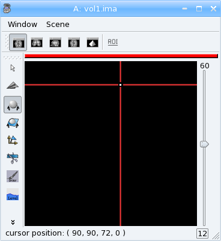

  3D volume: value 12 at voxel (100, 100 ,60)

Basic operations
++++++++++++++++

Whole volume operations:

>>> # multiplication, addition etc
>>> vol *= 2
>>> vol2 = vol * 3 + 12
>>> vol2.value(100, 100, 60)
84
>>> vol /= 2
>>> vol3 = vol2 - vol - 12
>>> vol3.value(100, 100, 60)
60
>>> vol4 = vol2 * vol / 6
>>> print(vol4.value(100, 100, 60))
168

Voxel-wise operations:

>>> # fill the volume with the distance to voxel (100, 100, 60)
>>> vs = vol.header()['voxel_size']
>>> pos0 = (100 * vs[0], 100 * vs[1], 60 * vs[2]) # in millimeters
>>> for z in range(vol.getSizeZ()):
...     for y in range(vol.getSizeY()):
...         for x in range(vol.getSizeX()):
...             # get current position in an aims.Point3df structure, in mm
...             p = aims.Point3df(x * vs[0], y * vs[1], z * vs[2])
...             # get relative position to pos0, in voxels
...             p -= pos0
...             # distance: norm of vector p
...             dist = p.norm()
...             # set it into the volume
...             vol.setValue(dist, x, y, z)

>>> vol.value(100, 100, 60)
0
>>> # save the volume
>>> aims.write(vol, 'distance.nii')

Now look at the *distance.nii* volume in Anatomist.

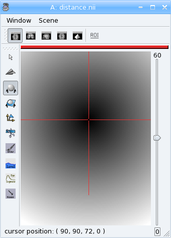

  Distance example

.. topic:: Exercise

  Make a program which loads the image *data_for_anatomist/subject01/Audio-Video_T_map.nii* and thresholds it so as to keep values above 3.

          
>>> from soma import aims
>>> vol = aims.read('data_for_anatomist/subject01/Audio-Video_T_map.nii')
>>> (vol.value(20, 20, 20) < 3.) and (vol.value(20, 20, 20) != 0.)
True
>>> for z in range(vol.getSizeZ()):
...     for y in range(vol.getSizeY()):
...         for x in range(vol.getSizeX()):
...             if vol.value(x, y, z) < 3.:
...                 vol.setValue(0, x, y, z)

>>> vol.value(20, 20, 20)
0.0

>>> aims.write(vol, 'Audio-Video_T_thresholded.nii')

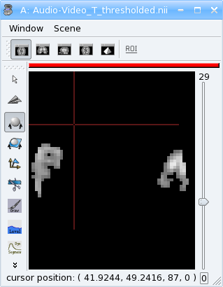

  Thresholded Audio-Video T-map

.. topic:: Exercise

  Make a program to dowsample the anatomical image *data_for_anatomist/subject01/subject01.nii* and keeps one voxel out of two in every direction.

>>> from soma import aims
>>> vol = aims.read('data_for_anatomist/subject01/subject01.nii')
>>> # allocate a new volume with half dimensions
>>> vol2 = aims.Volume(vol.getSizeX() / 2, vol.getSizeY() / 2, vol.getSizeZ() / 2, dtype='DOUBLE')
>>> vol2.getSizeX()
128
>>> # set the voxel size to twice it was in vol
>>> vs = vol.header()['voxel_size']
>>> vs2 = [x * 2 for x in vs]
>>> vol2.header()['voxel_size'] = vs2
>>> for z in range(vol2.getSizeZ()):
...     for y in range(vol2.getSizeY()):
...         for x in range(vol2.getSizeX()):
...             vol2.setValue(vol.value(x*2, y*2, z*2), x, y, z)

>>> vol.value(100, 100, 40)
775
>>> vol2.value(50, 50, 20)
775.0
>>> aims.write(vol2, 'resampled.nii')

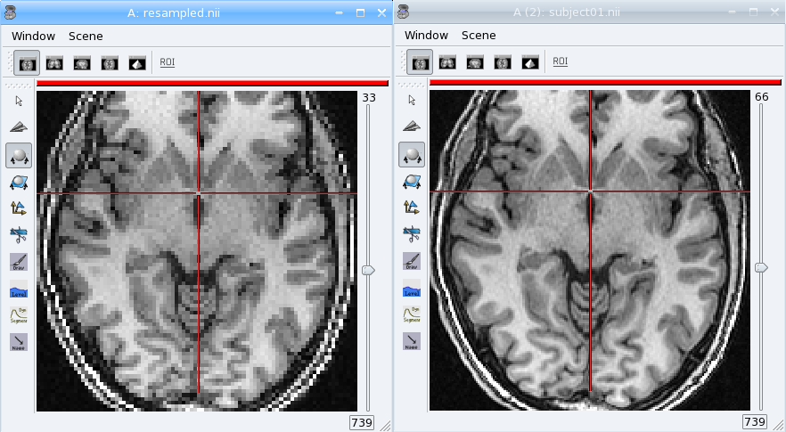
  
  Downsampled anatomical image
  

The first thing that comes to mind when running these examples, is that they are *slow*. 
Indeed, python is an interpreted language and loops in any interpreted language are slow. 
In addition, accessing individually each voxel of the volume has the overhead of python/C++ bindings communications. 
The conclusion is that that kind of example is probably a bit too low-level, and should be done, when possible, by compiled libraries or specialized array-handling libraries. 
This is the role of **numpy**.

Accessing numpy arrays to AIMS volume voxels is supported:

>>> import numpy
>>> vol.fill(0)
>>> arr = numpy.asarray(vol)
>>> # set value 100 in a whole sub-volume
>>> arr[60:120, 60:120, 40:80] = 100
>>> # note that arr is a shared view to the volume contents,
>>> # modifications will also affect the volume
>>> vol.value(65, 65, 42)
100
>>> vol.value(65, 65, 30)
0
>>> aims.write(vol, "cube.nii")

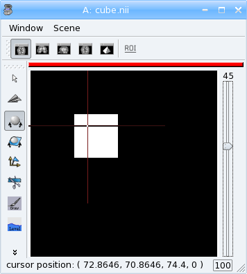

  3D volume containing a cube

Now we can re-write the thresholding example using numpy:

>>> from soma import aims
>>> vol = aims.read('data_for_anatomist/subject01/Audio-Video_T_map.nii')
>>> arr = numpy.asarray(vol)
>>> arr[numpy.where(arr < 3.)] = 0.
>>> vol.value(20, 20, 20)
0.0
>>> aims.write(vol, 'Audio-Video_T_thresholded2.nii')

Here, `arr < 3.` returns a boolean array with the same size as `arr`, and :py:func:`numpy.where()` returns arrays of coordinates where the specified contition is true.

The distance example, using numpy, would like the following:

>>> from soma import aims
>>> import numpy
>>> vol = aims.Volume(192, 256, 128, 'S16')
>>> vol.header()['voxel_size'] = [0.9, 0.9, 1.2, 1.]
>>> vs = vol.header()['voxel_size']
>>> pos0 = (100 * vs[0], 100 * vs[1], 60 * vs[2]) # in millimeters
>>> arr = numpy.asarray(vol)
>>> # build arrays of coordinates for x, y, z
>>> x, y, z = numpy.ogrid[0.:vol.getSizeX(), 0.:vol.getSizeY(), 0.:vol.getSizeZ()]
>>> # get coords in millimeters
>>> x *= vs[0]
>>> y *= vs[1]
>>> z *= vs[2]
>>> # relative to pos0
>>> x -= pos0[0]
>>> y -= pos0[1]
>>> z -= pos0[2]
>>> # get norm, using numpy arrays broadcasting
>>> arr[:, :, :, 0] = numpy.sqrt(x**2 + y**2 + z**2)

>>> vol.value(100, 100, 60)
0

>>> # and save result
>>> aims.write(vol, 'distance2.nii')

This example appears a bit more tricky, since we must build the coordinates arrays, but is way faster to execute, because all loops within the code are executed in compiled routines in numpy. 
One interesting thing to note is that this code is using the famous "array broadcasting" feature of numpy, where arrays of heterogeneous sizes can be combined, and the "missing" dimensions are extended.

Copying volumes or volumes structure, or building from an array
+++++++++++++++++++++++++++++++++++++++++++++++++++++++++++++++

To make a deep-copy of a volume, use the copy constructor:

>>> vol2 = aims.Volume(vol)
>>> vol2.setValue(12, 100, 100, 60)
>>> # now vol and vol2 have different values
>>> print('vol.value(100, 100, 60):', vol.value(100, 100, 60))
vol.value(100, 100, 60): 0
>>> print('vol2.value(100, 100, 60):', vol2.value(100, 100, 60))
vol2.value(100, 100, 60): 12

If you need to build another, different volume, with the same structure and size, don't forget to copy the header part:

>>> vol2 = aims.Volume(vol.getSizeX(), vol.getSizeY(), vol.getSizeZ(), vol.getSizeT(), 'FLOAT')
>>> vol2.header().update(vol.header())
>>> vol2.header()
{ 'volume_dimension' : [ 192, 256, 128, 1 ], 'sizeX' : 192, 'sizeY' : 256, 'sizeZ' : 128, 'sizeT' : 1, 'voxel_size' : [ 0.9, 0.9, 1.2, 1 ] }

Important information can reside in the header, like voxel size, or coordinates systems and geometric transformations to other coordinates systems, 
so it is really very important to carry this information with duplicated or derived volumes.

You can also build a volume from a numpy array:

>>> arr = numpy.array(numpy.diag(range(40)), dtype=numpy.float32).reshape(40, 40, 1) \
...     + numpy.array(range(20), dtype=numpy.float32).reshape(1, 1, 20)
>>> # WARNING: the array must be in Fortran ordering for AIMS, at leat at the moment
>>> # whereas the numpy addition always returns a C-ordered array
>>> arr = numpy.array(arr, order='F')
>>> arr[10, 12, 3] = 25
>>> vol = aims.Volume(arr)
>>> print('vol.value(10, 12, 3):', vol.value(10, 12, 3))
vol.value(10, 12, 3): 25.0

>>> # data are shared with arr
>>> vol.setValue(35, 10, 15, 2)
>>> print('arr[10, 15, 2]:', arr[10, 15, 2])
arr[10, 15, 2]: 35.0
>>> arr[12, 15, 1] = 44
>>> print('vol.value(12, 15, 1):', vol.value(12, 15, 1))
vol.value(12, 15, 1): 44.0

4D volumes
++++++++++

4D volumes work just like 3D volumes. Actually all volumes are 4D in AIMS, but the last dimension is commonly of size 1. 
In :py:meth:`soma.aims.Volume_FLOAT.value` and :py:meth:`soma.aims.Volume_FLOAT.setValue` methods, only the first dimension is mandatory, 
others are optional and default to 0, but up to 4 coordinates may be used. In the same way, the constructor takes up to 4 dimension parameters:

>>> from soma import aims
>>> # create a 4D volume of signed 16-bit ints, of size 30x30x30x4
>>> vol = aims.Volume(30, 30, 30, 4, 'S16')
>>> # fill it with zeros
>>> vol.fill(0)
>>> # set value 12 at voxel (10, 10, 20, 2)
>>> vol.setValue(12, 10, 10, 20, 2)
>>> # get value at the same position
>>> x = vol.value(10, 10, 20, 2)
>>> print(x)
12
>>> # set the voxels size
>>> vol.header()['voxel_size'] = [0.9, 0.9, 1.2, 1.]
>>> print(vol.header())
{ 'volume_dimension' : [ 30, 30, 30, 4 ], 'sizeX' : 30, 'sizeY' : 30, 'sizeZ' : 30, 'sizeT' : 4, 'voxel_size' : [ 0.9, 0.9, 1.2, 1 ] }

Similarly, 1D or 2D volumes may be used exactly the same way.

The older AimsData classes
++++++++++++++++++++++++++

For historical reasons, another set of classes may also represent volumes. These classes are the older API in AIMS, and tend to be obsolete. 
But as they were used in many many routines and programs, they have still not been eradicated. 
Many C++ routines build volumes and actually return those older classes, so we could not really hide them, and they also have python bindings. 
These classes are `aims.AimsData_<type>`, for example :py:class:`soma.aims.AimsData_FLOAT`. 
Converting from and to :py:class:`soma.aims.Volume_FLOAT` classes is rather simple since the newer `Volume` classes are used internally in the `AimsData` API.

>>> from soma import aims
>>> # create a 4D volume of signed 16-bit ints, of size 30x30x30x4
>>> vol = aims.Volume(30, 30, 30, 4, 'S16')
>>> vol.header()['voxel_size'] = [0.9, 0.9, 1.2, 1.]
>>> advol = aims.AimsData(vol)
>>> # vol and advol share the same header and voxel data
>>> vol.setValue(12, 10, 10, 20, 2)
>>> print('advol.value(10, 10, 20, 2):', advol.value(10, 10, 20, 2))
advol.value(10, 10, 20, 2): 12
>>> advol.setValue(44, 12, 12, 24, 1)
>>> print('vol.value(12, 12, 24, 1):', vol.value(12, 12, 24, 1))
vol.value(12, 12, 24, 1): 44

And, in the other direction:

>>> # create a 4D volume of signed 16-bit ints, of size 30x30x30x4
>>> advol = aims.AimsData(30, 30, 30, 4, 'S16')
>>> advol.header()['voxel_size'] = [0.9, 0.9, 1.2, 1.]
>>> vol = advol.volume()
>>> # vol and advol share the same header and voxel data
>>> vol.setValue(12, 10, 10, 20, 2)
>>> print('advol.value(10, 10, 20, 2):', advol.value(10, 10, 20, 2))
advol.value(10, 10, 20, 2): 12
>>> advol.setValue(44, 12, 12, 24, 1)
>>> print('vol.value(12, 12, 24, 1):', vol.value(12, 12, 24, 1))
vol.value(12, 12, 24, 1): 44

`AimsData` has a bit richer API, since it includes minor processing functions that have been removed from the newer `Volume` for the sake of API simplicity and minimalism.

>>> # minimum / maximum
>>> print('min:', advol.minimum(), 'at', advol.minIndex())
min: 0 at ((0, 0, 0, 0), 0)
>>> print('max:', advol.maximum(), 'at', advol.maxIndex())
max: 44 at ((12, 12, 24, 1), 44)

>>> # clone copy
>>> advol2 = advol.clone()
>>> advol2.setValue(12, 4, 8, 11, 3)
>>> # now advol and advol2 have different values
>>> print('advol.value(4, 8, 11, 3):', advol.value(4, 8, 11, 3))
advol.value(4, 8, 11, 3): 0
>>> print('advol2.value(4, 8, 11, 3):', advol2.value(4, 8, 11, 3))
advol2.value(4, 8, 11, 3): 12

>>> # Border handling
>>> # Border width is th 5th parameter of AimsData constructor
>>> advol = aims.AimsData(192, 256, 128, 1, 2, 'S16')
>>> advol.header()['voxel_size'] = [0.9, 0.9, 1.2, 1.]
>>> advol.fill(0)
>>> advol.setValue(15, 100, 100, 60)
>>> vol = advol.volume()
>>> refvol = vol.refVolume()
>>> # the underlying refvol is 4 voxels wider in each direction, and shifted:
>>> print('refvol.value(100, 100, 60):', refvol.value(100, 100, 60))
refvol.value(100, 100, 60): 0
>>> # ... it is 0, not 15...
>>> print('refvol.value(102, 102, 62):', refvol.value(102, 102, 62))
refvol.value(102, 102, 62): 15
>>> # here we get 15
>>> # some algorithms require this border to exist, otherwise fail or crash...
>>> from soma import aimsalgo
>>> aimsalgo.AimsDistanceFrontPropagation(advol, 0, -1, 3, 3, 3, 10, 10)
>>> aims.write(advol, 'distance3.nii')

Meshes
------

Structure
+++++++++

A surfacic mesh represents a surface, as a set of small polygons (generally triangles, but sometimes quads). 
It has two main components: a vector of vertices (each vertex is a 3D point, with coordinates in millimeters), 
and a vector of polygons: each polygon is defined by the vertices it links (3 for a triangle). It also optionally has normals (unit vectors). 
In our mesh structures, there is one normal for each vertex.

>>> from soma import aims
>>> mesh = aims.read('data_for_anatomist/subject01/subject01_Lhemi.mesh')
>>> vert = mesh.vertex()
>>> print('vertices:', len(vert))
vertices: 33837
>>> poly = mesh.polygon()
>>> print('polygons:', len(poly))
polygons: 67678
>>> norm = mesh.normal()
>>> print('normals:', len(norm))
normals: 33837

To build a mesh, we can instantiate an object of type `aims.AimsTimeSurface_<n>_VOID`,
for example :py:class:`soma.aims.AimsTimeSurface_3_VOID`, with *n* being the number of vertices by polygon. VOID means that the mesh has no texture in it (which we generally don't use, we prefer using texture as separate objects).
Then we can add vertices, normals and polygons to the mesh:

>>> # build a flying saucer mesh
>>> from soma import aims
>>> import numpy
>>> mesh = aims.AimsTimeSurface(3)
>>> # a mesh has a header
>>> mesh.header()['toto'] = 'a message in the header'
>>> vert = mesh.vertex()
>>> poly = mesh.polygon()
>>> x = numpy.cos(numpy.ogrid[0.: 20] * numpy.pi / 10.) * 100
>>> y = numpy.sin(numpy.ogrid[0.: 20] * numpy.pi / 10.) * 100
>>> z = numpy.zeros(20)
>>> c = numpy.vstack((x, y, z)).transpose()
>>> vert.assign([aims.Point3df(0., 0., -40.), aims.Point3df(0., 0., 40.)] + [aims.Point3df(x) for x in c])
>>> pol = numpy.vstack((numpy.zeros(20, dtype=numpy.int32), numpy.ogrid[3: 23], numpy.ogrid[2: 22])).transpose()
>>> pol[19, 1] = 2
>>> pol2 = numpy.vstack((numpy.ogrid[2: 22], numpy.ogrid[3: 23], numpy.ones(20, dtype=numpy.int32))).transpose()
>>> pol2[19, 1] = 2
>>> poly.assign([aims.AimsVector(x, dtype='U32',dim=3) for x in numpy.vstack((pol, pol2))])
>>> # write result
>>> aims.write(mesh, 'saucer.mesh')
>>> # automatically calculate normals
>>> mesh.updateNormals()

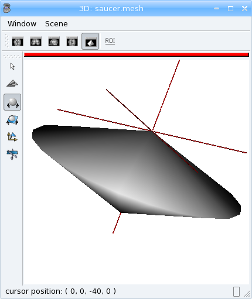

  Flying saucer mesh

Modifying a mesh
++++++++++++++++

>>> # slightly inflate a mesh
>>> from soma import aims
>>> import numpy
>>> mesh = aims.read('data_for_anatomist/subject01/subject01_Lwhite.mesh')
>>> vert = mesh.vertex()
>>> varr = numpy.array(vert)
>>> norm = numpy.array(mesh.normal())
>>> varr += norm * 2 # push vertices 2mm away along normal
>>> vert.assign([aims.Point3df(x) for x in varr])
>>> mesh.updateNormals()
>>> aims.write(mesh, 'subject01_Lwhite_semiinflated.mesh')

Now look at both meshes in Anatomist...

Alternatively, without numpy, we could have written the code like this:

>>> mesh = aims.read('data_for_anatomist/subject01/subject01_Lwhite.mesh')
>>> vert = mesh.vertex()
>>> norm = mesh.normal()
>>> for v, n in zip(vert, norm):
...     v += n * 2
>>> mesh.updateNormals()
>>> aims.write(mesh, 'subject01_Lwhite_semiinflated.mesh')

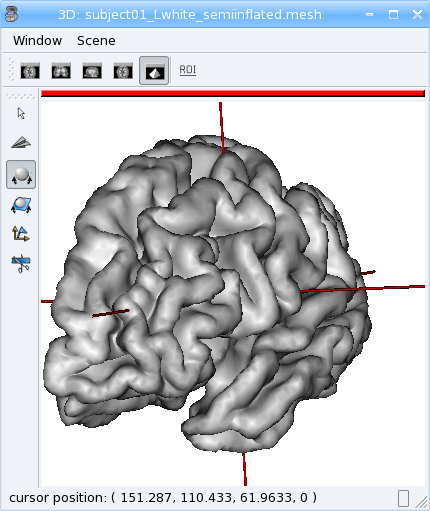

  Inflated mesh

Handling time
+++++++++++++

In AIMS, meshes are actually time-indexed dictionaries of meshes. 
This way a deforming mesh can be stored in the same object. 
To copy a timestep to another, use the following:

>>> from soma import aims
>>> mesh = aims.read('data_for_anatomist/subject01/subject01_Lwhite.mesh')
>>> # mesh.vertex() is equivalent to mesh.vertex(0)
>>> mesh.vertex(1).assign(mesh.vertex(0))
>>> # same for normals and polygons
>>> mesh.normal(1).assign(mesh.normal(0))
>>> mesh.polygon(1).assign(mesh.polygon(0))
>>> print('number of time steps:', mesh.size())
number of time steps: 2

.. topic:: Exercise

  Make a deforming mesh that goes from the original mesh to 5mm away, by steps of 0.5 mm

>>> from soma import aims
>>> import numpy
>>> mesh = aims.read('data_for_anatomist/subject01/subject01_Lwhite.mesh')
>>> vert = mesh.vertex()
>>> varr = numpy.array(vert)
>>> norm = numpy.array(mesh.normal())
>>> for i in range(1, 10):
...     mesh.normal(i).assign(mesh.normal())
...     mesh.polygon(i).assign(mesh.polygon())
...     varr += norm * 0.5
...     mesh.vertex(i).assign([aims.Point3df(x) for x in varr])
>>> print('number of time steps:', mesh.size())
number of time steps: 10
>>> mesh.updateNormals()
>>> aims.write(mesh, 'subject01_Lwhite_semiinflated_time.mesh')

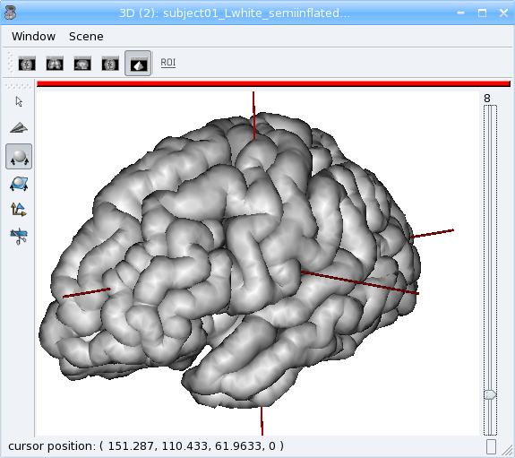

  Inflated mesh with timesteps

Textures
--------

A texture is merely a vector of values, each of them is assigned to a mesh vertex, with a one-to-one mapping, in the same order.
A texture is also a time-texture.

>>> from soma import aims
>>> tex = aims.TimeTexture('FLOAT')
>>> t = tex[0] # time index, inserts on-the-fly
>>> t.reserve(10) # pre-allocates memory
>>> for i in range(10):
...     t.append(i / 10.)
>>> print(tex.size())
1
>>> print(tex[0].size())
10
>>> print(tex[0][5])
0.5

.. topic:: Exercise

  Make a time-texture, with at each time/vertex of the previous mesh, sets the value of the underlying volume *data_for_anatomist/subject01/subject01.nii*

>>> from soma import aims
>>> mesh = aims.read('subject01_Lwhite_semiinflated_time.mesh')
>>> vol = aims.read('data_for_anatomist/subject01/subject01.nii')
>>> tex = aims.TimeTexture('FLOAT')
>>> vs = vol.header()['voxel_size']
>>> for i in range(mesh.size()):
...     t = tex[i]
...     vert = mesh.vertex(i)
...     t.reserve(len(vert))
...     for p in vert:
...         t.append(vol.value(*[int(round(x / y)) for x, y in zip(p, vs)]))
>>> aims.write(tex, 'subject01_Lwhite_semiinflated_texture.tex')

Now look at the texture on the mesh (inflated or not) in Anatomist. Compare it to a 3D fusion between the mesh and the MRI volume.

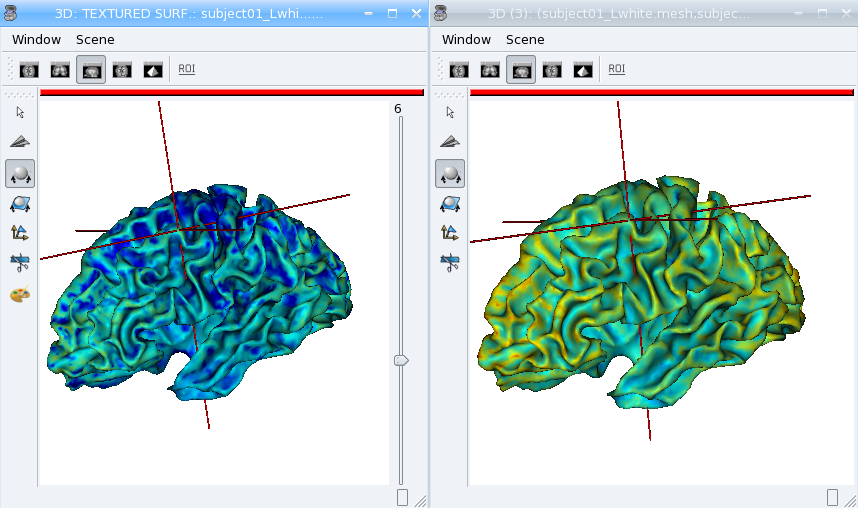

  Computed time-texture vs 3D fusion

**Bonus:** We can do the same for functional data. 
But in this case we may have a spatial transformation to apply between anatomical data and functional data 
(which may have been normalized, or acquired in a different referential).

>>> from soma import aims
>>> import numpy
>>> mesh = aims.read('subject01_Lwhite_semiinflated_time.mesh')
>>> vol = aims.read('data_for_anatomist/subject01/Audio-Video_T_map.nii')
>>> # get header info from anatomical volume
>>> f = aims.Finder()
>>> f.check('data_for_anatomist/subject01/subject01.nii')
True
>>> anathdr = f.header()
>>> # get functional -> MNI transformation
>>> m1 = aims.AffineTransformation3d(vol.header()['transformations'][1])
>>> # get anat -> MNI transformation
>>> m2 = aims.AffineTransformation3d(anathdr['transformations'][1])
>>> # make anat -> functional transformation
>>> anat2func = m1.inverse() * m2
>>> # include functional voxel size to get to voxel coordinates
>>> vs = vol.header()['voxel_size']
>>> mvs = aims.AffineTransformation3d(numpy.diag(vs[:3] + [1.]))
>>> anat2func = mvs.inverse() * anat2func
>>> # now go as in the previous program
>>> tex = aims.TimeTexture('FLOAT')
>>> for i in range(mesh.size()):
...     t = tex[i]
...     vert = mesh.vertex(i)
...     t.reserve(len(vert))
...     for p in vert:
...         t.append(vol.value(*[int(round(x)) for x in anat2func.transform(p)]))
>>> aims.write(tex, 'subject01_Lwhite_semiinflated_audio_video.tex')

See how the functional data on the mesh changes across the depth of the cortex. 
This demonstrates the need to have a proper projection of functional data before dealing with surfacic functional processing.

Buckets
-------

"Buckets" are voxels lists. They are typically used to represent ROIs.
A BucketMap is a list of Buckets. Each Bucket contains a list of voxels coordinates.
A BucketMap is represented by the class :py:class:`soma.aims.BucketMap_VOID`.

>>> from soma import aims
>>> bck_map=aims.read('data_for_anatomist/roi/basal_ganglia.data/roi_Bucket.bck')
>>> print('Bucket map: ', bck_map)
Bucket map:  <soma.aims.BucketMap_VOID object at ...
>>> print('Nb buckets: ', bck_map.size())
Nb buckets:  15
>>> for i in range(bck_map.size()):
...     b = bck_map[i]
...     print("Bucket", i, ", nb voxels:", b.size())
...     if b.keys():
...         print("  Coordinates of the first voxel:", b.keys()[0].list())
Bucket 0 , nb voxels: 2314
  Coordinates of the first voxel: [108, 132, 44]
Bucket 1 , ...

Graphs
------

Graphs are data structures that may contain various elements. 
They can represent sets of smaller structures, and also relations between such structures. 
The main usage we have for them is to represent ROIs sets, sulci, or fiber bundles.
A graph is represented by the class :py:class:`soma.aims.Graph`.

A graph contains:
  * properties of any type, like a volume or mesh header.
  * nodes (also called vertices), which represent structured elements (a ROI, a sulcus part, etc), 
    which in turn can store properties, and geometrical elements: buckets, meshes...
  * optionally, relations, which link nodes and can also contain properties and geometrical elements.

Properties
++++++++++

Properties are stored in a dictionary-like way. They can hold almost anything, but a restricted set of types can be saved and loaded. 
It is exactly the same thing as headers found in volumes, meshes, textures or buckets.

>>> from soma import aims
>>> graph = aims.read('data_for_anatomist/roi/basal_ganglia.arg')
>>> print(graph)
{ '__syntax__' : 'RoiArg', 'RoiArg_VERSION' : '1.0', 'filename_base' : 'basal_ganglia.data', ...
>>> print('properties:', graph.keys())
properties: ('RoiArg_VERSION', 'filename_base', 'roi.global.bck', 'type.global.bck', 'boundingbox_max', ...
>>> for p, v in graph.items():
...     print(p, ':', str(v))
RoiArg_VERSION : 1.0
filename_base : basal_ganglia.data
roi.global.bck : roi roi_Bucket.bck roi_label
type.global.bck : roi.global.bck
boundingbox_max : [255, 255, 123]
boundingbox_min : [0, 0, 0]
...
>>> graph['gudule'] = [12, 'a comment']

.. note:: Only properties declared in a "syntax" file may be saved and re-loaded. Other properties are just not saved.

Vertices
++++++++

Vertices (or nodes) can be accessed via the vertices() method. Each vertex is also a dictionary-like properties set.

>>> for v_name in sorted([v['name'] for v in graph.vertices()]):
...     print(v_name)
Caude_droit
Caude_gauche
Corps_caude_droit
Corps_caude_gauche
Pallidum_droit
...

To insert a new vertex, the :py:meth:`soma.aims.Graph.addVertex()` method should be used:

>>> v = graph.addVertex('roi')
>>> print(v)
{ '__syntax__' : 'roi' }
>>> v['name'] = 'new ROI'

Edges
+++++

An edge, or relation, links nodes together. Up to now we have always used binary, unoriented, edges. 
They can be added using the :py:meth:`soma.aims.Graph.addEdge()` method. 
Edges are also dictionary-like properties sets.

>>> v2 = [x for x in graph.vertices() if x['name'] == 'Pallidum_gauche'][0]
>>> del x
>>> e = graph.addEdge(v, v2, 'roi_link')
>>> print(graph.edges())
[ { '__syntax__' : 'roi_link' } ]
>>> # get vertices linked by this edge
>>> print(sorted([x['name'] for x in e.vertices()]))
['Pallidum_gauche', 'new ROI']

Adding meshes or buckets in a graph vertex or relation
++++++++++++++++++++++++++++++++++++++++++++++++++++++

Setting meshes or buckets in vertices properties is OK internally, 
but for saving and loading, additional consistancy must be ensured and internal tables update is required. 
Then, use the :py:func:`soma.aims.GraphManip.storeAims` function:

>>> mesh = aims.read('data_for_anatomist/subject01/subject01_Lwhite.mesh')
>>> # store mesh in the 'roi' property of vertex v of graph graph
>>> aims.GraphManip.storeAims(graph, v, 'roi', mesh)

Other examples
--------------

There are other examples for pyaims `here <../examples>`_.

Using algorithms
================

AIMS contains, in addition to the different data structures used in neuroimaging, a set of algorithms which operate on these structures. 
Currently only a few of them have Python bindings, because we develop these bindings in a "lazy" way, only when they are needed. 
The algorithms currently available include data conversion, resampling, thresholding, 
mathematical morphology, distance maps, the mesher, some mesh generators, and a few others. 
But most of the algorithms are still only available in C++.

Volume Thresholding
-------------------

>>> from soma import aims, aimsalgo
>>> # read a volume with 2 voxels border
>>> vol = aims.read('data_for_anatomist/subject01/subject01.nii', border=2)
>>> # use a thresholder which will keep values above 600
>>> ta = aims.AimsThreshold(aims.AIMS_GREATER_OR_EQUAL_TO, 600, intype=vol)
>>> # use it to make a binary thresholded volume
>>> tvol = ta.bin(vol)
>>> print(tvol.value(0, 0, 0))
0
>>> print(tvol.value(100, 100, 50))
32767
>>> aims.write(tvol, 'thresholded.nii')

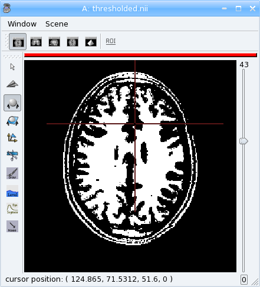

  Thresholded T1 MRI

.. warning:: Some algorithms need that the volume they process have a **border**: a few voxels all around the volume. 
  Indeed, some algorithms can try to access voxels outside the boundaries of the volume which may cause a segmentation error if the volume doesn't have a border. 
  That's the case for example for operations like erosion, dilation, closing. 
  There's no test in each point to detect if the algorithm tries to access outside the volume because it would slow down the process.

  In the previous example, a 2 voxels border is added by passing a parameter *border=2* to :py:func:`soma.aims.read` function.

Mathematical morphology
-----------------------

>>> # apply 5mm closing
>>> clvol = aimsalgo.AimsMorphoClosing(tvol, 5)
>>> aims.write(clvol, 'closed.nii')

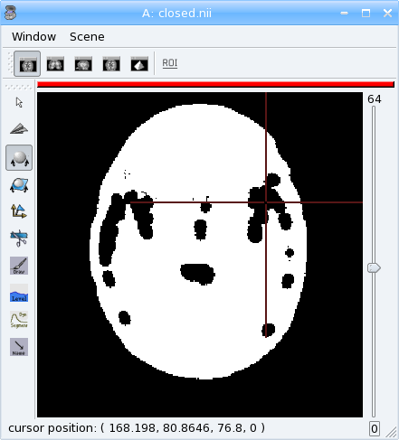

  Closing of a thresholded T1 MRI

Mesher
------

>>> m = aimsalgo.Mesher()
>>> mesh = aims.AimsSurfaceTriangle() # create an empty mesh
>>> # the border should be -1
>>> clvol.fillBorder(-1)
>>> # get a smooth mesh of the interface of the biggest connected component
>>> m.getBrain(clvol, mesh)
>>> aims.write(mesh, 'head_mesh.gii')

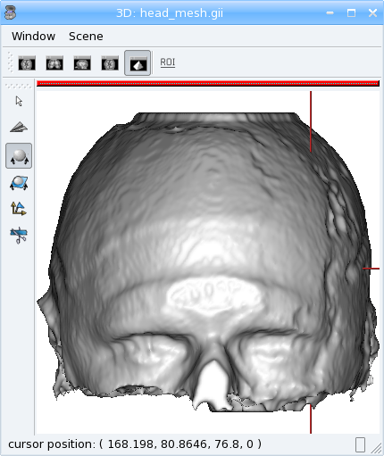
  
  Head mesh

The above examples make up a simplified version of the head mesh extraction algorithm in `VipGetHead`, used in the Morphologist pipeline.

Surface generation
------------------

The :py:class:`soma.aims.SurfaceGenerator` allows to create simple meshes of predefined shapes: cube, cylinder, sphere, icosehedron, cone, arrow.

>>> from soma import aims
>>> center = (50, 25, 20)
>>> radius = 53
>>> mesh1 = aims.SurfaceGenerator.icosahedron(center, radius)
>>> mesh2 = aims.SurfaceGenerator.generate({'type': 'arrow', 'point1': [30, 70, 0],
...     'point2': [100, 100, 100], 'radius': 20, 'arrow_radius': 30,
...     'arrow_length_factor': 0.7, 'facets': 50})
>>> # get the list of all possible generated objects and parameters:
>>> print(aims.SurfaceGenerator.description())
[ { 'arrow_length_factor' : 'relative length of the head', 'arrow_radius' : ...

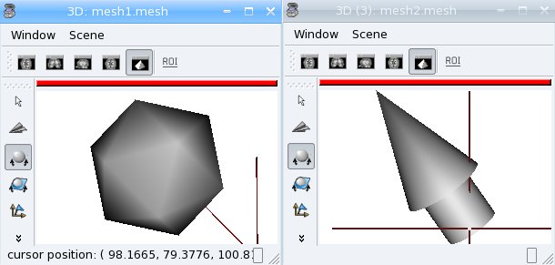

  Generated icosahedron and arrow

Interpolation
-------------

Interpolators help to get values in millimeters coordinates in a discrete space (volume grid), and may allow voxels values mixing (linear interpolation, typically).

>>> from soma import aims
>>> # load a functional volume
>>> vol = aims.read('data_for_anatomist/subject01/Audio-Video_T_map.nii')
>>> # get the position of the maximum
>>> pmax, maxval = aims.AimsData_DOUBLE(vol).maxIndex()
>>> # set pmax in mm
>>> vs = vol.header()['voxel_size']
>>> pmax = [x * y for x,y in zip(pmax, vs)]
>>> # take a sphere of 5mm radius, with about 200 vertices
>>> mesh = aims.SurfaceGenerator.sphere(pmax[:3], 5., 200)
>>> vert = mesh.vertex()
>>> # get an interpolator
>>> interpolator = aims.aims.getLinearInterpolator(vol)
>>> # create a texture for that sphere
>>> tex = aims.TimeTexture_FLOAT()
>>> tx = tex[0]
>>> tx2 = tex[1]
>>> tx.reserve(len(vert))
>>> tx2.reserve(len(vert))
>>> for v in vert:
...     tx.append(interpolator.value(v))
...     # compare to non-interpolated value
...     tx2.append(vol.value(*[int(round(x / y)) for x,y in zip(v, vs)]))
>>> aims.write(tex, 'functional_tex.gii')
>>> aims.write(mesh, 'sphere.gii')

Look at the difference between the two timesteps (interpolated and non-interpolated) of the texture in Anatomist.

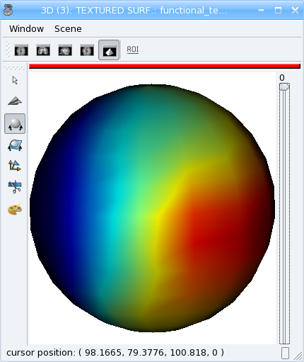

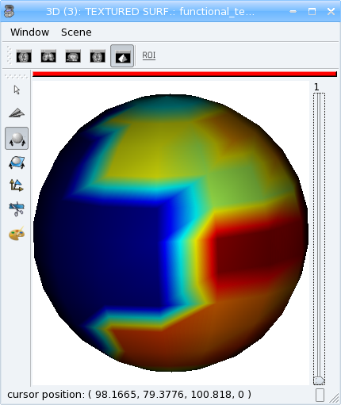

  Interpolated vs not interpolated texture

Types conversion
----------------

The `Converter_*_*` classes allow to convert some data structures types to others. 
Of course all types cannot be converted to any other, but they are typically used ton convert volumed from a given voxel type to another one. 
A "factory" function may help to build the correct converter using input and output types. 
For instance, to convert the anatomical volume of the previous examples to float type:

>>> from soma import aims
>>> vol = aims.read('data_for_anatomist/subject01/subject01.nii')
>>> print('type of vol:', type(vol))
type of vol: <class 'soma.aims.Volume_S16'>
>>> c = aims.Converter(intype=vol, outtype=aims.Volume('FLOAT'))
>>> vol2 = c(vol)
>>> print('type of converted volume:', type(vol2))
type of converted volume: <class 'soma.aims.Volume_FLOAT'>
>>> print('value of initial volume at voxel (50, 50, 50):', vol.value(50, 50, 50))
value of initial volume at voxel (50, 50, 50): 57
>>> print('value of converted volume at voxel (50, 50, 50):', vol2.value(50, 50, 50))
value of converted volume at voxel (50, 50, 50): 57.0

Resampling
----------

Resampling allows to apply a geometric transformation or/and to change voxels size. 
Several types of resampling may be used depending on how we interpolate values between neighbouring voxels (see interpolators): 
nearest-neighbour (order 0), linear (order 1), spline resampling with order 2 to 7 in AIMS.

>>> from soma import aims, aimsalgo
>>> import math
>>> vol = aims.read('data_for_anatomist/subject01/subject01.nii')
>>> # create an affine transformation matrix
>>> # rotating pi/8 along z axis
>>> tr = aims.AffineTransformation3d(aims.Quaternion([0, 0, math.sin(math.pi / 16), math.cos(math.pi / 16)]))
>>> tr.setTranslation((100, -50, 0))
>>> # get an order 2 resampler for volumes of S16
>>> resp = aims.ResamplerFactory_S16().getResampler(2)
>>> resp.setDefaultValue(-1) # set background to -1
>>> resp.setRef(vol) # volume to resample
>>> # resample into a volume of dimension 200x200x200 with voxel size 1.1, 1.1, 1.5
>>> resampled = resp.doit(tr, 200, 200, 200, (1.1, 1.1, 1.5))
>>> # Note that the header transformations to external referentials have been updated
>>> print(resampled.header()['referentials'])
["Scanner-based anatomical coordinates", "Talairach-MNI template-SPM"]
>>> import numpy
>>> if [int(x) for x in numpy.__version__.split('.')] >= [1, 14]:
...     # print the same way whatever numpy version
...     numpy.set_printoptions(precision=4, legacy='1.13')
... else:
...     numpy.set_printoptions(precision=4)
>>> for t in resampled.header()['transformations']:
...   print(aims.AffineTransformation3d( t ))
[[  -0.9239   -0.3827    0.      193.2538]
 [   0.3827   -0.9239    0.       34.6002]
 [   0.        0.       -1.       73.1996]
 [   0.        0.        0.        1.    ]]
[[ -9.6797e-01  -4.1623e-01   1.0548e-02   2.0329e+02]
 [  3.8418e-01  -8.9829e-01   3.6210e-02   2.8707e+00]
 [  3.9643e-03  -2.0773e-02  -1.2116e+00   9.3405e+01]
 [  0.0000e+00   0.0000e+00   0.0000e+00   1.0000e+00]]
>>> aims.write(resampled, 'resampled.nii')

Load the original image and the resampled in Anatomist. 
See how the resampled has been rotated. Now apply the NIFTI/SPM referential info on both images. 
They are now aligned again, and cursor clicks correctly go to the same location on both volume, whatever the display referential for each of them.

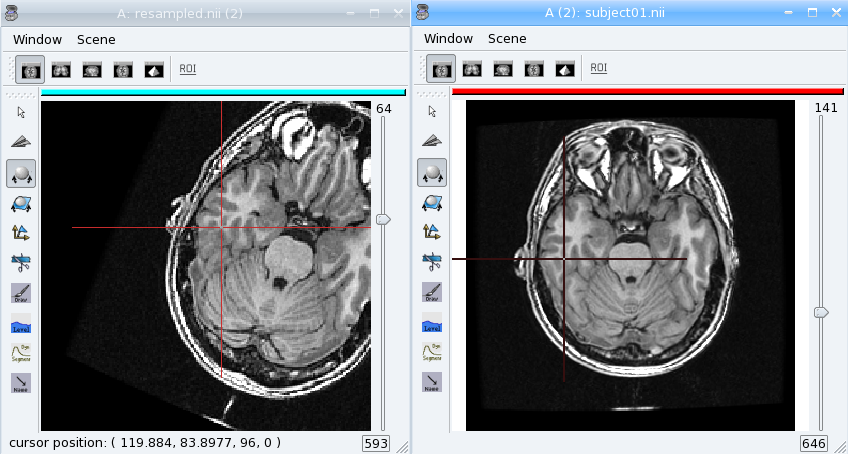
  
  Aimsalgo resampling

.. _aims_training%pyaims_pyanatomist:

PyAIMS / PyAnatomist integration
================================

It is possible to use both PyAims and PyAnatomist APIs together in python.
See :pyanatomist:`the Pyanatomist / PyAims tutorial <pyanatomist_pyaims_tutorial.html>`.

